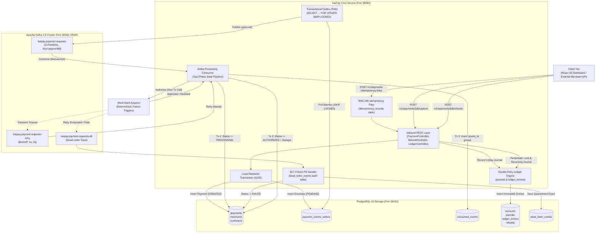
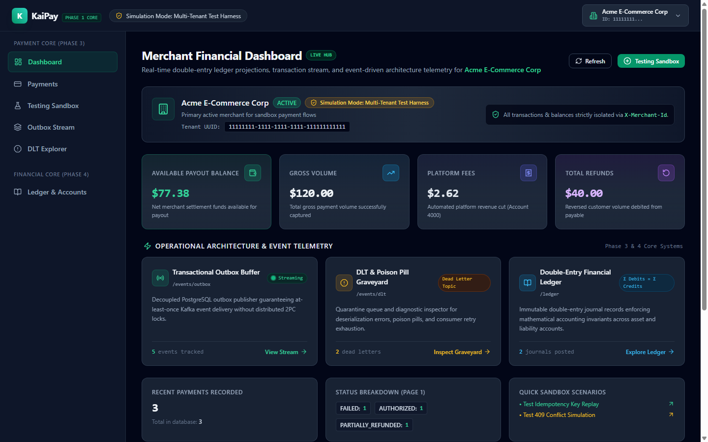
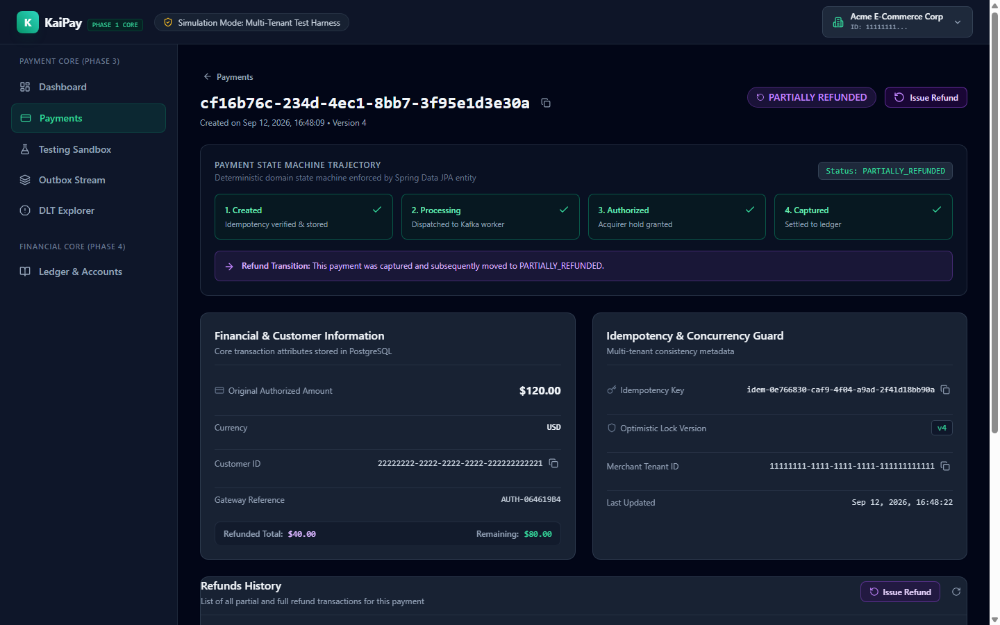
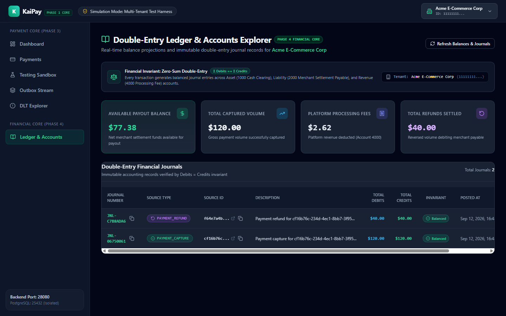
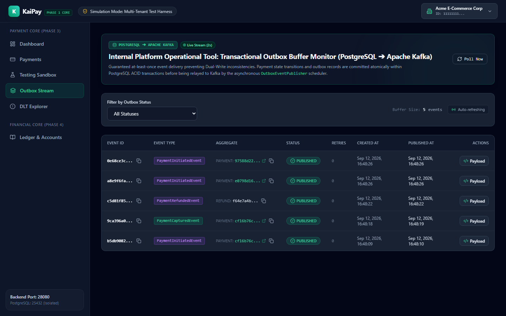
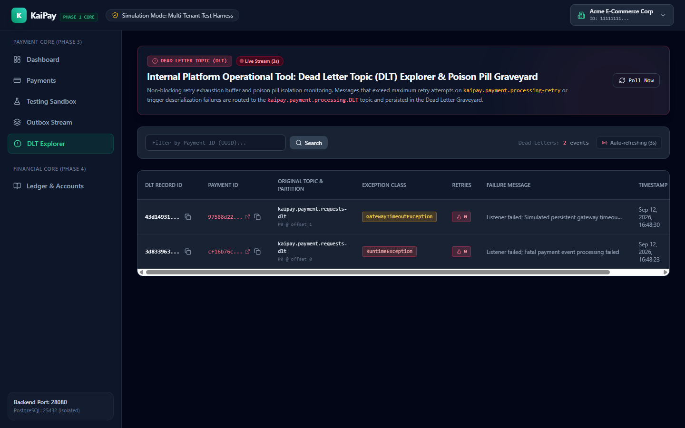

# KaiPay: High-Throughput Distributed Payment & Double-Entry Ledger Engine

[](https://openjdk.org/projects/jdk/21/)
[](https://spring.io/projects/spring-boot)
[-black.svg)](https://kafka.apache.org/)
[](https://www.postgresql.org/)
[](https://testcontainers.com/)
[](https://react.dev/)
[](https://tailwindcss.com/)
[](https://opensource.org/licenses/MIT)

KaiPay is a distributed payment processing and financial accounting engine built with **Java 21**, **Spring Boot 3.4.3**, **Apache Kafka 3.8.0 (KRaft mode)**, and **PostgreSQL 16**. It is engineered to solve core distributed systems consistency and reliability challenges: the distributed dual-write problem, at-least-once message delivery, head-of-line blocking during downstream bank latency, idempotency under uncoordinated retries, and strict double-entry ledger accounting invariants.

---

## 1. Project Overview

In payment processing architectures, services must prevent data loss, prevent duplicate customer charges, provide observable lifecycle state, and maintain strict mathematical balance across all accounts—even during network partitions, bank partner outages, pod crash rebalances, and concurrent retries.

KaiPay demonstrates production-style solutions to these engineering challenges:

- **Distributed Dual-Write Elimination**: Combines local database transaction commits with an asynchronous Transactional Outbox poller using PostgreSQL row-level locks (`SELECT ... FOR UPDATE SKIP LOCKED`).
- **Effectively-Once Business Processing**: Mitigates duplicate bank charges across crash windows and Kafka message redeliveries using an atomic consumer deduplication table (`consumed_events`) and a two-phase status pipeline (`CREATED` $\to$ `PROCESSING` $\to$ `AUTHORIZED` / `DECLINED`).
- **Non-Blocking Multi-Topic Retries**: Eliminates consumer partition Head-of-Line blocking via Spring Kafka `@RetryableTopic` with exponential backoff and Dead Letter Topic (`kaipay.payment.requests-dlt`) quarantine.
- **Strict Double-Entry Financial Ledger**: Records all monetary movements via immutable Journal entries and balanced Ledger Entries enforcing $\sum \text{Debits} = \sum \text{Credits}$ with integer-cent precision (`BIGINT amount_cents`).
- **Pessimistic Locking on Financial Aggregates**: Guards against concurrent partial and full refund race conditions (`SELECT ... FOR UPDATE`) to prevent over-refunding.
- **Operational Full-Stack Visibility**: Provides an operational administrative interface built with React 18, TypeScript, and Tailwind CSS to observe live outbox buffers, dead-letter events, and ledger journals in real time.

---

## 2. System Architecture



---

## 3. Key Technical Decisions

| # | Technical Challenge | Proposed Solution | Tradeoff Considered |
| :- | :--- | :--- | :--- |
| **1** | **Distributed Dual-Write Problem** | **Transactional Outbox Pattern** with PostgreSQL row-level polling using `SELECT ... FOR UPDATE SKIP LOCKED`. Payment aggregate mutations and event envelopes commit atomically within the local ACID boundary. | Introduces asynchronous event publishing polling latency (~500ms) compared to direct synchronous broker publishing, but eliminates ghost events and uncommitted message leaks without requiring 2PC/XA. |
| **2** | **Consumer Crash Window & Redeliveries** | **Two-Phase Consumer Pipeline with Atomic Deduplication Table (`consumed_events`)** keyed by `(event_id, consumer_group)`. Pre-check skips redeliveries; state transition to `AUTHORIZED` and deduplication insert commit together. | Requires an additional database write per processed event, but prevents duplicate external bank acquirer calls when consumers crash prior to Kafka offset commit. |
| **3** | **Consumer Head-of-Line (HoL) Blocking** | **Non-Blocking Multi-Topic Retries** using Spring Kafka `@RetryableTopic` with exponential backoff (1s, 2s, max 3 attempts) and automated Dead Letter Topic (`kaipay.payment.requests-dlt`) routing. | Redelivered messages on retry topics consume additional partition bandwidth, but avoid blocking healthy transactions on the primary partition during third-party gateway latency spikes. |
| **4** | **Financial Balance Integrity** | **Immutable Double-Entry Ledger Engine** with standardized chart of accounts and strict zero-sum balancing invariant ($\sum \text{Debits} = \sum \text{Credits}$). Balances are projected from ledger entries. | Balance calculations require SQL aggregate queries over immutable ledger rows rather than reading a single scalar column, but guarantees mathematical consistency and full auditability. |
| **5** | **Concurrent Over-Refund Race Conditions** | **Pessimistic Write Locking (`PESSIMISTIC_WRITE`)** on parent payment records (`SELECT ... FOR UPDATE`) during refund calculation and persistence. | Serializes concurrent refunds for the exact same payment, but prevents concurrent refund requests from exceeding the original captured transaction amount. |

---

## 4. Technology Stack

| Layer / Component | Technology | Version | Purpose & Architectural Rationale |
| :--- | :--- | :--- | :--- |
| **Language** | Java | 21 (LTS) | Virtual threads readiness, pattern matching, record classes, strong type safety |
| **Framework** | Spring Boot | 3.4.3 | Portfolio-grade DI container, Spring Data JPA, Spring Kafka, declarative transactions |
| **Message Broker** | Apache Kafka | 3.8.0 (KRaft) | High-throughput distributed log, partition ordering, KRaft consensus (ZooKeeper-less) |
| **Database** | PostgreSQL | 16-alpine | ACID relational integrity, `SKIP LOCKED` row queuing, partial indexes, atomic constraints |
| **Schema Migration**| Flyway | 10.x | Deterministic, version-controlled relational database migrations (V1 through V5) |
| **Integration Testing**| Testcontainers | 1.20.4 | Ephemeral, production-identical Docker containers for PostgreSQL 16 and Kafka 3.8 |
| **Frontend Framework**| React | 18.3.1 | Declarative component UI for operational payments, double-entry ledger, outbox & DLT views |
| **Build Tool** | Vite | 6.1.0 | Fast ESM development server and optimized TypeScript bundling |
| **Type System** | TypeScript | 5.7.3 | Strict type safety for API contracts, event payloads, and ledger journal models |
| **Styling** | Tailwind CSS | 3.4.17 | Modern utility-first CSS design system |
| **Icons** | Lucide React | 0.475.0 | Clean financial and operational telemetry icon set |

---

## 5. Core Features

- **8-State Payment Lifecycle**: Finite state machine supporting `CREATED`, `PROCESSING`, `AUTHORIZED`, `CAPTURED`, `PARTIALLY_REFUNDED`, `REFUNDED`, `DECLINED`, and `FAILED` (`DLT_ROUTED`).
- **Cryptographic Request Idempotency**: SHA-256 hashing across HTTP request payload, headers, and paths to prevent duplicate submissions while safely returning cached responses on retries.
- **Transactional Outbox Worker**: Background poller (`fixedDelay = 500ms`, batch size = 20) with `SKIP LOCKED` row claiming, publishing events to Kafka with manual synchronous acknowledgments.
- **Resilient Kafka Processing**: Partition-key routing on `paymentId`, manual immediate consumer offset acknowledgment, and non-blocking retry topics.
- **Poison Pill & Failure Simulation**: Deterministic amount-based triggers in `MockBankAcquirerClient`:
  - **`$8,888.00`**: Transient gateway timeout on attempts 1 & 2, succeeds on attempt 3 via retry topic.
  - **`$7,777.00`**: Persistent gateway timeout exhausting all 3 retry attempts and routing to Dead Letter Topic.
  - **`$6,666.00`**: Fatal non-retryable gateway error routing immediately to DLT.
  - **`$9,999.00`**: Business decline (`INSUFFICIENT_FUNDS`), transitioning payment to `DECLINED`.
- **Double-Entry Financial Ledger**: Multi-tenant chart of accounts, 3-way capture journal posting, reversing refund journals, Stripe-style pro-rata fee retention ($0.30 fixed fee retained on full refunds).
- **Multi-Tenant Isolation**: Merchant tenant scoping on all queries, accounts, payments, and refunds via foreign key references and API authentication headers.
- **Interactive Operations UI**: Real-time management dashboards, visual state machine steppers, outbox queue inspectors, DLT payload viewers, and double-entry ledger explorers.

---

## 6. System Flows & Accounting Model

### 6.1. Payment Processing Lifecycle Flow

```
1. Client submits POST /v1/payments (with Idempotency-Key & X-Merchant-Id).
2. IdempotencyFilter checks idempotency_records (SHA-256 hash validation).
3. PaymentService starts Local DB Tx:
   - Persists Payment aggregate (status = CREATED).
   - Persists EventEnvelope<PaymentInitiatedEvent> in payment_events_outbox (status = PENDING).
   - Commits Local DB Tx.
4. OutboxEventPublisher polls pending events using SELECT ... FOR UPDATE SKIP LOCKED:
   - Emits message to Kafka topic 'kaipay.payment.requests' (partition key = paymentId).
   - Updates outbox record (status = PUBLISHED, published_at = NOW()).
5. PaymentProcessingConsumer receives event:
   - Queries consumed_events table (fast pre-check).
   - Tx 1: Transitions payment status to PROCESSING.
   - Calls MockBankAcquirerClient.authorize(...) outside database transaction.
   - Tx 2: Commits payment status (AUTHORIZED or DECLINED) and inserts consumed_events record atomically.
   - Manually acknowledges Kafka consumer offset.
```

---

### 6.2. Double-Entry Accounting Model (Capture & Refund)

KaiPay enforces the strict double-entry balance invariant:
$$\sum \text{Debits} = \sum \text{Credits}$$

#### Chart of Accounts
- **`1000-CUSTOMER-RECEIVABLE`** (Type: `ASSET`): Represents clearing funds owed by customer banks.
- **`2000-MERCHANT-{ID}-LIABILITY`** (Type: `LIABILITY`): Represents platform liability owed to the merchant for payouts.
- **`4000-PLATFORM-FEE-REVENUE`** (Type: `REVENUE`): Platform transaction fee revenue.

#### Capture Fee Policy
- $\text{FeeCents} = \min\big(\text{GrossAmount}, \; \text{round}(\text{GrossAmount} \times 2.9\%) + 30\big)$
- $\text{NetMerchantCents} = \text{GrossAmount} - \text{FeeCents}$

#### Refund Fee Policy
- Variable processing fee ($2.9\%$) is refunded proportionally: $\text{FeeRefundCents} = \text{round}(\text{RefundAmount} \times 2.9\%)$.
- Fixed gateway fee ($0.30) is retained by the platform to cover interchange and network operational costs.
- On a 100% full refund of a single transaction, the merchant's net position is $-\$0.30$.
- Across two consecutive fully refunded transactions, the merchant's net position is $-\$0.60$.

#### Exact Capture & Refund Journal Entries ($120.00 Capture, $40.00 Partial Refund, $80.00 Remaining Refund)

```
====================================================================================================
1. Payment Capture ($120.00 USD)
   - Gross Amount: $120.00 | Fee (2.9% + $0.30): $3.78 | Net Merchant: $116.22
----------------------------------------------------------------------------------------------------
Account                                    Type        Debit (USD)         Credit (USD)
----------------------------------------------------------------------------------------------------
1000-CUSTOMER-RECEIVABLE                   ASSET       $ 120.00            -
2000-MERCHANT-LIABILITY                    LIABILITY   -                   $ 116.22
4000-PLATFORM-FEE-REVENUE                  REVENUE     -                   $   3.78
----------------------------------------------------------------------------------------------------
SUBTOTAL:                                              $ 120.00            $ 120.00 (BALANCED)

====================================================================================================
2. Partial Refund ($40.00 USD)
   - Refund Amount: $40.00 | Fee Refund (2.9%): $1.16 | Net Merchant Debit: $38.84
----------------------------------------------------------------------------------------------------
Account                                    Type        Debit (USD)         Credit (USD)
----------------------------------------------------------------------------------------------------
2000-MERCHANT-LIABILITY                    LIABILITY   $  38.84            -
4000-PLATFORM-FEE-REVENUE                  REVENUE     $   1.16            -
1000-CUSTOMER-RECEIVABLE                   ASSET       -                   $  40.00
----------------------------------------------------------------------------------------------------
SUBTOTAL:                                              $  40.00            $  40.00 (BALANCED)

====================================================================================================
3. Full Remaining Refund ($80.00 USD)
   - Refund Amount: $80.00 | Fee Refund (2.9%): $2.32 | Net Merchant Debit: $77.68
----------------------------------------------------------------------------------------------------
Account                                    Type        Debit (USD)         Credit (USD)
----------------------------------------------------------------------------------------------------
2000-MERCHANT-LIABILITY                    LIABILITY   $  77.68            -
4000-PLATFORM-FEE-REVENUE                  REVENUE     $   2.32            -
1000-CUSTOMER-RECEIVABLE                   ASSET       -                   $  80.00
----------------------------------------------------------------------------------------------------
SUBTOTAL:                                              $  80.00            $  80.00 (BALANCED)

====================================================================================================
FINAL LIFECYCLE RECONCILIATION
- Total Customer Receivable Debits ($120.00) == Total Customer Receivable Credits ($40.00 + $80.00) = $0.00
- Merchant Payable Balance: Credit $116.22 - Debit $38.84 - Debit $77.68 = -$0.30 (Fixed fee retained)
- Platform Revenue Balance: Credit $3.78 - Debit $1.16 - Debit $2.32 = +$0.30 (Platform earned revenue)
====================================================================================================
```

---

## 7. Visual Portfolio Assets

All visual documentation is captured directly from the live, running KaiPay application stack:

### 7.1. Financial Analytics & Operational Telemetry Dashboard

*Real-time financial KPI cards showing available payout balance ($77.38 after fee retention), gross volume, platform fees, operational buffers, and recent transactions with live status badges.*

---

### 7.2. Payment State Machine & Lifecycle Management

*Interactive state machine visualization tracking progression through `CREATED` $\to$ `PROCESSING` $\to$ `AUTHORIZED` $\to$ `CAPTURED` $\to$ `PARTIALLY_REFUNDED`, displaying cryptographic idempotency headers and refund history.*

---

### 7.3. Double-Entry Financial Ledger & Balanced Journals

*Multi-account ledger explorer showing immutable journal entries, real-time balance projections, and strict $\sum \text{Debits} = \sum \text{Credits}$ balance verification.*

---

### 7.4. Transactional Outbox Stream Monitor

*Live outbox monitor displaying pending vs. published event states, payload envelopes, and row claim coordination.*

---

### 7.5. Dead Letter Topic (DLT) & Poison Pill Graveyard

*Operational quarantine inspector displaying dead-lettered events, original partition/offset positions, retry attempt counts, and Java exception stack traces.*

---

## 8. Running the Project

### Dedicated Port Map

KaiPay uses strictly dedicated host ports to ensure total isolation from other host services:

| Service | Container / Process | Host Port | Internal Port | Environment / Connection String |
| :--- | :--- | :--- | :--- | :--- |
| **KaiPay Backend API** | Spring Boot | **`28080`** | `28080` | `http://localhost:28080` |
| **KaiPay Frontend UI** | Vite / React | **`28081`** | `28081` | `http://localhost:28081` |
| **KaiPay PostgreSQL** | Docker (`postgres:16-alpine`) | **`25432`** | `5432` | `jdbc:postgresql://localhost:25432/kaipay` |
| **KaiPay Apache Kafka** | Docker (`apache/kafka:3.8.0`) | **`29092`** | `9092` | `localhost:29092` |
| **KaiPay Kafka-UI** | Docker (`provectuslabs/kafka-ui`) | **`28048`** | `8080` | `http://localhost:28048` |
| **KaiPay Redis (Reserved)**| Docker (`redis:7-alpine`) | **`26379`** | `6379` | `localhost:26379` |

---

### Prerequisites
- **JDK 21** installed.
- **Node.js 18+** and **npm** installed.
- **Docker** and **Docker Compose** running.

---

### Step 1: Start Infrastructure (PostgreSQL, Kafka, Kafka-UI)
From the repository root:
```bash
docker compose up -d
```
Verify container status:
```bash
docker compose ps
```

---

### Step 2: Build & Start Backend Application
```bash
cd backend
./mvnw clean spring-boot:run
```
*The API service starts on port `28080`. Flyway automatically runs database migrations V1 through V5 on initial startup.*

---

### Step 3: Start Frontend Dashboard
```bash
cd frontend
npm install
npm run dev
```
*The management dashboard will be available at `http://localhost:28081`.*

---

### Step 4: Verify Live Operational Endpoints
- **Frontend Dashboard**: [http://localhost:28081](http://localhost:28081)
- **Kafka-UI Management Console**: [http://localhost:28048](http://localhost:28048)
- **Merchant Balance Endpoint**: `GET http://localhost:28080/v1/ledger/balance` (requires `X-Merchant-Id` header)
- **Transactional Outbox Event Stream**: `GET http://localhost:28080/v1/events/outbox`
- **Dead Letter Topic (DLT) Events**: `GET http://localhost:28080/v1/events/dlt`

---

## 9. Automated Testing Strategy

KaiPay is verified by an automated test suite comprising **180 automated tests** across 40 test classes:

```text
-------------------------------------------------------
 T E S T S   S U M M A R Y
-------------------------------------------------------
Tests run: 180, Failures: 0, Errors: 0, Skipped: 0
Build Result: SUCCESS
Total Time: 49.350 s
-------------------------------------------------------
```

### Test Classification

1. **Unit & Invariant Tests (POJOs & Core Domain Logic)**:
   - FSM state transition validation (`PaymentStateMachineUnitTest`)
   - Double-entry debit/credit zero-sum mathematical validation (`LedgerServiceUnitTest`, `MerchantBalanceServiceUnitTest`)
   - Structured JSON envelope serialization and deserialization (`EventEnvelopeUnitTest`)
2. **PostgreSQL Integration Tests (Testcontainers PostgreSQL 16)**:
   - Flyway migration execution and relational constraints (V1–V5)
   - SHA-256 API idempotency conflicts and duplicate suppression (`PaymentIntegrationTest`)
   - Pessimistic write locking concurrency across 10 concurrent threads (`RefundIntegrationTest`, `LedgerFinancialInvariantsIntegrationTest`)
   - Journal creation, balance projection queries, and over-refund prevention
3. **Kafka Event-Driven Integration Tests (Testcontainers Kafka 3.8 KRaft)**:
   - Transactional outbox polling and publishing during broker network outages (`OutboxKafkaOutageIntegrationTest`)
   - Consumer deduplication under forced message redeliveries (`PaymentDeduplicationIntegrationTest`, `PaymentGatewayRedeliveryIntegrationTest`)
   - Head-of-line blocking avoidance across multi-partition workloads (`PaymentHeadOfLinePartitionIntegrationTest`)
   - Non-blocking retries with exponential backoff and DLT routing (`PaymentTransientRetryIntegrationTest`, `PaymentPoisonPillAndDltIntegrationTest`)

To execute the automated test suite locally:
```bash
cd backend
./mvnw test
```

---

## 10. Project Directory Layout

```
KaiPay/
├── backend/                             # Spring Boot 3.4.3 Core Service (Java 21)
│   ├── src/main/java/com/lky/kaipay/
│   │   ├── common/                      # EventEnvelope, Base DTOs, Kafka & DB Config
│   │   ├── consumer/                    # Deduplication service & consumed_events tracking
│   │   ├── customer/                    # Customer entity & repository
│   │   ├── dlt/                         # DLT admin controller, entity & repository
│   │   ├── ledger/                      # Double-entry ledger service, journals, accounts
│   │   ├── merchant/                    # Merchant tenant entity, controller & API key auth
│   │   ├── outbox/                      # Transactional outbox publisher & admin controller
│   │   ├── payment/                     # Payment aggregate, FSM, consumer & acquirer client
│   │   └── refund/                      # Refund service, controller, and pessimistic locking
│   ├── src/main/resources/
│   │   ├── application.yaml             # Dedicated ports & Kafka/Postgres config
│   │   └── db/migration/                # Flyway migrations V1 through V5
│   └── src/test/java/                   # 180 Automated Unit & Testcontainers tests
├── frontend/                            # React 18 / TypeScript Operational Dashboard
│   ├── src/
│   │   ├── api/                         # Typed REST API clients (payment, ledger, outbox, dlt)
│   │   ├── components/                  # Navigation layout, sidebar, modal inspectors
│   │   ├── models/                      # TypeScript models for payments, ledger, outbox, dlt
│   │   ├── pages/                       # Dashboard, Payment Details, Ledger, Outbox, DLT
│   │   ├── App.tsx                      # Route declarations
│   │   └── main.tsx                     # React root & TanStack Query client setup
│   ├── package.json                     # React 18.3, Vite 6.1, Tailwind CSS 3.4
│   └── vite.config.ts                   # Port 28081 configuration & proxy rules
├── docker-compose.yml                   # Postgres 16 (25432), Kafka 3.8 (29092), Kafka-UI (28048)
├── docs/                                # Technical documentation suite
│   ├── architecture.md                  # Comprehensive architectural specification
│   ├── event-catalog.md                 # Domain event schemas and topic topology
│   ├── failure-handling-and-retries.md  # Non-blocking retries, DLT, and deduplication
│   ├── double-entry-ledger.md           # Accounting proofs and balance projections
│   ├── career-portfolio.md              # Master career reference & interview scenario bank
│   ├── engineering-journal-...md        # Engineering post-mortem & distributed systems lessons
│   └── screenshots/                     # 5 real high-resolution screenshots from live UI
├── .env.example                         # Environment variable configuration template
├── .gitignore                           # Git hygiene configuration
└── LICENSE                              # MIT License
```

---

## 11. Complete Documentation Catalog

For detailed architectural specifications, event contracts, failure handling models, and career reference guides, refer to the documents in [`docs/`](docs/):

| Document | Description |
| :--- | :--- |
| **[Architecture & Database Schemas](docs/architecture.md)** | Modular bounded contexts, Flyway V1–V5 schemas, aggregate roots, transaction boundaries, and indexing. |
| **[Domain Event Catalog](docs/event-catalog.md)** | Formal schema specifications for `EventEnvelope<T>`, domain events, topic topologies, and serialization rules. |
| **[Failure Handling & Non-Blocking Retries](docs/failure-handling-and-retries.md)** | Failure taxonomy, Spring Kafka `@RetryableTopic` + `@DltHandler` mechanics, and consumer deduplication algorithms. |
| **[Double-Entry Financial Ledger](docs/double-entry-ledger.md)** | Chart of accounts, mathematical balance proofs ($\sum \text{Debits} = \sum \text{Credits}$), 3-way journals, and balance queries. |
| **[Master Career & Technical Portfolio](docs/career-portfolio.md)** | 12 technical deep-dives, 16 in-depth interview scenarios, quantifiable metrics, and resume bullet points. |
| **[Engineering Journal & Lessons Learned](docs/engineering-journal-lessons-learned.md)** | Detailed engineering post-mortem on dual-write traps, `SKIP LOCKED` tuning, and consumer crash recovery. |

---

## 12. License

This project is licensed under the MIT License. See [LICENSE](LICENSE) for details.
