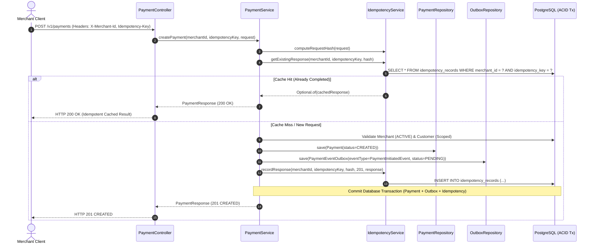
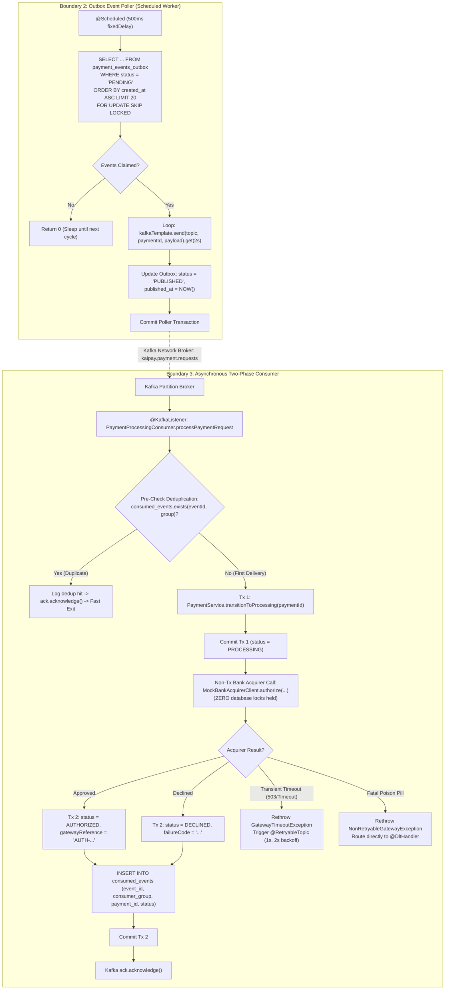

# KaiPay Architecture Reality Check & Implementation Audit

This document provides a deep, evidence-based technical audit of the KaiPay distributed payment processing engine. Every architectural claim made across design specifications, API contracts, and engineering documentation is scrutinized directly against the actual codebase, SQL schemas, transaction boundaries, and test suite.

---

## 1. Executive Summary & Claim Classification Matrix

Every architectural claim is classified into one of six rigorous categories:
- **`VERIFIED`**: Proven by existing source code, relational constraints, and passing automated tests.
- **`OBSERVED`**: Present and active in the runtime codebase, with specific operational behaviors noted.
- **`INFERENCE`**: Logically derived from current design, but lacks dedicated automated stress assertions.
- **`ASSUMPTION`**: Documented as design intent, but relies on external environmental configurations or unverified defaults.
- **`INCORRECT`**: Inconsistency or mismatch between documentation claims and actual source code.
- **`UNVERIFIED`**: Claimed in documentation or roadmaps but currently omitted or unimplemented in the codebase.

### 1.1. Master Architectural Verification Table

| # | System Area / Claim | Documentation Claim | Actual Codebase Reality | Classification | Evidence & File Location |
| :- | :--- | :--- | :--- | :--- | :--- |
| 1 | **Dual-Write Prevention** | ACID transaction envelopes domain write and outbox publish request | Writes `Payment` and `PaymentEventOutbox` within a single `@Transactional` boundary | **`VERIFIED`** | [`PaymentService.java`](../backend/src/main/java/com/lky/kaipay/payment/service/PaymentService.java#L54-L148) |
| 2 | **Outbox Poller Concurrency** | Multi-worker parallel polling without lock contention using `FOR UPDATE SKIP LOCKED` | Native SQL query executing `SELECT * FROM payment_events_outbox WHERE status = 'PENDING' ORDER BY created_at ASC LIMIT :limit FOR UPDATE SKIP LOCKED` | **`VERIFIED`** | [`PaymentEventOutboxRepository.java`](../backend/src/main/java/com/lky/kaipay/outbox/repository/PaymentEventOutboxRepository.java#L18-L19) |
| 3 | **Non-Blocking Retries** | Transient acquirer failures do not block Kafka partition progress | Spring Kafka `@RetryableTopic` routes `GatewayTimeoutException` to `-retry` topics, leaving main topic unblocked | **`VERIFIED`** | [`PaymentProcessingConsumer.java`](../backend/src/main/java/com/lky/kaipay/payment/consumer/PaymentProcessingConsumer.java#L46-L54), [`PaymentHeadOfLinePartitionIntegrationTest.java`](../backend/src/test/java/com/lky/kaipay/payment/consumer/PaymentHeadOfLinePartitionIntegrationTest.java) |
| 4 | **Two-Phase Consumer Execution** | Decouples long-latency external bank HTTP calls from active database transactions | Separate Tx 1 (`status = PROCESSING`) $\to$ Non-Tx Acquirer Call $\to$ Tx 2 (`status = AUTHORIZED/DECLINED` + `consumed_events`) | **`VERIFIED`** | [`PaymentProcessingConsumer.java`](../backend/src/main/java/com/lky/kaipay/payment/consumer/PaymentProcessingConsumer.java#L80-L89) |
| 5 | **Consumer Deduplication** | Composite PK `(event_id, consumer_group)` prevents duplicate charges on Kafka redelivery | Relational table `consumed_events` with composite primary key, checked before gateway call and written atomically in Tx 2 | **`VERIFIED`** | [`V4__create_consumed_events_and_dlt_schema.sql`](../backend/src/main/resources/db/migration/V4__create_consumed_events_and_dlt_schema.sql#L6-L14), [`PaymentDeduplicationIntegrationTest.java`](../backend/src/test/java/com/lky/kaipay/payment/consumer/PaymentDeduplicationIntegrationTest.java) |
| 6 | **Pessimistic Refund Concurrency** | Prevents concurrent race conditions from over-refunding captured payments | `findByIdAndMerchantIdForUpdate` applies `PESSIMISTIC_WRITE` (`SELECT ... FOR UPDATE`) on parent `Payment` aggregate | **`VERIFIED`** | [`RefundService.java`](../backend/src/main/java/com/lky/kaipay/refund/service/RefundService.java#L55-L73), [`RefundIntegrationTest.java`](../backend/src/test/java/com/lky/kaipay/refund/RefundIntegrationTest.java) |
| 7 | **Double-Entry Ledger Balancing** | Strict mathematical zero-sum balancing ($\sum \text{Debits} = \sum \text{Credits}$) | `LedgerService.postJournal` evaluates sum of debits vs credits; throws `UnbalancedJournalException` on imbalance | **`VERIFIED`** | [`LedgerService.java`](../backend/src/main/java/com/lky/kaipay/ledger/service/LedgerService.java#L72-L87), [`LedgerFinancialInvariantsIntegrationTest.java`](../backend/src/test/java/com/lky/kaipay/ledger/service/LedgerFinancialInvariantsIntegrationTest.java) |
| 8 | **Fee Retention Accounting** | Fixed fee ($0.30) retained by platform on full refunds; variable fee (2.9%) refunded | Capture fee = $2.9\% + 30¢$; Refund fee = $2.9\%$. Net merchant position on 100% refund is $-30¢$ | **`VERIFIED`** | [`LedgerService.java`](../backend/src/main/java/com/lky/kaipay/ledger/service/LedgerService.java#L123-L125), [`LedgerService.java`](../backend/src/main/java/com/lky/kaipay/ledger/service/LedgerService.java#L168-L170) |
| 9 | **Monetary Integrity (No Float)** | Absolute elimination of floating-point rounding errors | All monetary columns across all tables typed as `BIGINT amount_cents` with `CHECK (amount_cents > 0)` | **`VERIFIED`** | Flyway V1, V5; Java models (`Long amountCents`) |
| 10 | **DLT Replay & Redrive API** | REST API endpoints for manual DLT event retry and replay | `DltAdminController` only implements `GET /v1/events/dlt`. No `POST /v1/events/dlt/{id}/replay` exists | **`INCORRECT`** | [`DltAdminController.java`](../backend/src/main/java/com/lky/kaipay/dlt/api/DltAdminController.java#L24-L45), [`docs/failure-handling-and-retries.md`](../docs/failure-handling-and-retries.md#L209) |
| 11 | **Redis Distributed Caching** | Redis caching for API idempotency fast-path lookup | `IdempotencyService` queries PostgreSQL `idempotency_records` table directly. Redis port (26379) is reserved in config, but client is not wired | **`UNVERIFIED`** | [`IdempotencyService.java`](../backend/src/main/java/com/lky/kaipay/payment/service/IdempotencyService.java), [`application.yaml`](../backend/src/main/resources/application.yaml#L7) |
| 12 | **Outbox Synchronous Blocking** | Outbox publisher claims batch and publishes asynchronously | Publisher invokes `kafkaTemplate.send(...).get(2, TimeUnit.SECONDS)` sequentially in a blocking loop inside `@Transactional` | **`OBSERVED`** | [`OutboxEventPublisher.java`](../backend/src/main/java/com/lky/kaipay/outbox/service/OutboxEventPublisher.java#L39-L58) |
| 13 | **Distributed Tracing / MDC** | Cross-service correlation ID propagation across HTTP, DB, and Kafka | `EventEnvelope` contains `eventId`, but no HTTP Filter, Slf4j MDC, or Kafka Header propagation interceptor is registered | **`UNVERIFIED`** | [`EventEnvelope.java`](../backend/src/main/java/com/lky/kaipay/common/event/EventEnvelope.java) |

---

## 2. End-to-End Execution Trace: Inbound HTTP to Database Persistence



### Trace Details:
1. **Inbound HTTP Adapter**: `PaymentController.createPayment` handles `POST /v1/payments`. Requires `X-Merchant-Id` (UUID) and `Idempotency-Key` (String), and triggers Bean Validation (`@Valid @RequestBody CreatePaymentRequest`).
2. **Deterministic Payload Hashing**: `IdempotencyService.computeRequestHash` constructs a normalized canonical string (`amount=...;currency=...;customer=...;method=...;metadata=...`) and computes a SHA-256 hex digest.
3. **Idempotency Guard**:
   - If `idempotency_records` contains the tuple `(merchant_id, idempotency_key)` with a matching SHA-256 hash and valid expiration (`expires_at > NOW()`), the cached JSON response is deserialized and returned immediately.
   - If the key exists but the SHA-256 payload hash differs, `IdempotencyConflictException` is thrown (mapped to HTTP 409 Conflict).
4. **Aggregate Construction & Single Transaction Commit**:
   - `Payment` aggregate is instantiated in `CREATED` status.
   - `PaymentInitiatedEvent` domain payload is wrapped in `EventEnvelope<T>` and serialized to JSON.
   - `PaymentEventOutbox` row is created with `status = PENDING`.
   - `Payment`, `PaymentEventOutbox`, and `IdempotencyRecord` are committed together in a single local ACID transaction.
   - If a concurrent thread races on the same `(merchant_id, idempotency_key)`, PostgreSQL enforces the `uk_merchant_idempotency` unique index, catching `DataIntegrityViolationException` and returning the winner's committed response.

---

## 3. Asynchronous Lifecycle: Outbox Poller to Two-Phase Consumer



---

## 4. Transactional Outbox Mechanics: Concurrency, Crash Recovery, and Duplicate Risks

### 4.1. Row Claiming via `FOR UPDATE SKIP LOCKED`
In `PaymentEventOutboxRepository`:
```sql
SELECT * FROM payment_events_outbox 
WHERE status = 'PENDING' 
ORDER BY created_at ASC 
LIMIT :limit 
FOR UPDATE SKIP LOCKED;
```
- **Concurrency Guarantee**: When $N$ application instances run pollers concurrently, PostgreSQL locks only the claimed batch of 20 rows for the active transaction. Competing workers skip already-locked rows and claim the subsequent 20 rows without blocking or serialization deadlocks.
- **Index Efficiency**: Backed by partial index `CREATE INDEX idx_outbox_pending ON payment_events_outbox (created_at ASC) WHERE status = 'PENDING'`, ensuring the query scans only active pending records regardless of table size.

### 4.2. Crash Recovery & Duplicate Publication Window
Consider the failure window during outbox event publishing:
```
[Worker Claims Row 101] -> [Sends to Kafka Broker (Broker ACKs)] -> 💥 JVM / Network Outage Before DB Commit 💥
```
- **Failure Impact**: The message was successfully written to Kafka partition storage, but the local transaction in Spring Boot failed before updating `payment_events_outbox.status = 'PUBLISHED'`.
- **Recovery**: The PostgreSQL transaction rolls back or connection drops, unlocking row 101. On the next scheduled polling tick, another worker claims row 101 and publishes it again to Kafka.
- **Deduplication Requirement**: Because the outbox pattern guarantees **At-Least-Once publication**, downstream consumers **must** be idempotent. KaiPay solves this via the `consumed_events` table.

---

## 5. Kafka Delivery Guarantees & Non-Blocking Retry Topology

### 5.1. Head-of-Line (HoL) Blocking Elimination
Standard blocking retries (`Thread.sleep`) halt partition message consumption, delaying all independent merchant traffic on that partition. KaiPay eliminates this using Spring Kafka's non-blocking multi-topic retry pattern:

```
[ Topic: kaipay.payment.requests ] (Partitions 0, 1, 2)
  ├── Offset 0: Payment A ($50.00)   ──> Processed successfully (Acked)
  ├── Offset 1: Payment B ($88.88)   ──> GatewayTimeoutException (Acked on Main, forwarded to Retry Topic)
  ├── Offset 2: Payment C ($60.00)   ──> Processed immediately! (Zero delay from Payment B)
  └── Offset 3: Poison Pill (Bad JSON)──> Fatal parsing error (Forwarded directly to DLT)

[ Topic: kaipay.payment.requests-retry ] (Backoff: 1s, 2s)
  ├── Attempt 1 (after 1000ms): Payment B ──> GatewayTimeoutException
  └── Attempt 2 (after 2000ms): Payment B ──> Acquirer Recovers ──> AUTHORIZED (Acked)

[ Topic: kaipay.payment.requests-dlt ] (Dead Letter Topic)
  ├── Quarantined Poison Pill ──> Persisted to dead_letter_events table
  └── Exhausted Retries ($77.77) ──> Payment marked FAILED (DLT_ROUTED) + dead_letter_events audit
```

### 5.2. Exception Routing Matrix

| Exception Class | Retry Topic Routing | Delay / Backoff | Terminal Action | State Invariant |
| :--- | :--- | :--- | :--- | :--- |
| `GatewayTimeoutException` | `kaipay.payment.requests-retry` | 1s initial, multiplier 2.0 (attempts = 3) | Re-evaluates acquirer call; routes to DLT on exhaustion | Stays in `PROCESSING` until resolved or marked `FAILED` |
| `GatewayUnavailableException` | `kaipay.payment.requests-retry` | 1s initial, multiplier 2.0 (attempts = 3) | Re-evaluates acquirer call; routes to DLT on exhaustion | Stays in `PROCESSING` until resolved or marked `FAILED` |
| `NonRetryableGatewayException` | None (Direct to DLT) | 0ms | Handled by `@DltHandler` | Marked `FAILED` (`DLT_ROUTED`) |
| `IllegalArgumentException` (Poison Pill) | None (Direct to DLT) | 0ms | Handled by `@DltHandler` | Raw payload persisted to `dead_letter_events` |

---

## 6. Multi-Layer Idempotency Architecture

KaiPay implements five distinct layers of idempotency defense across the request lifecycle:

```
+---------------------------------------------------------------------------------------------------+
| 1. API Ingress Layer: PostgreSQL idempotency_records (SHA-256 Request Hash + 24h Expiry)         |
+---------------------------------------------------------------------------------------------------+
                                                  |
                                                  v
+---------------------------------------------------------------------------------------------------+
| 2. DB Unique Constraint Layer: uk_merchant_idempotency on payments (merchant_id, idempotency_key)|
+---------------------------------------------------------------------------------------------------+
                                                  |
                                                  v
+---------------------------------------------------------------------------------------------------+
| 3. Outbox Claim Layer: SELECT FOR UPDATE SKIP LOCKED (Prevents duplicate worker event dispatch)   |
+---------------------------------------------------------------------------------------------------+
                                                  |
                                                  v
+---------------------------------------------------------------------------------------------------+
| 4. Bank Acquirer Gateway Key: paymentId idempotency ledger in MockBankAcquirerClient               |
+---------------------------------------------------------------------------------------------------+
                                                  |
                                                  v
+---------------------------------------------------------------------------------------------------+
| 5. Consumer Deduplication Layer: pk_consumed_events on consumed_events (event_id, consumer_group) |
+---------------------------------------------------------------------------------------------------+
```

### Layer Verification Summary:
1. **API Ingress Layer**: Computes SHA-256 hash over payment fields. Cached responses are returned without touching backend domain entities. Mismatched payload hashes raise `IdempotencyConflictException` (409).
2. **Database Unique Constraint**: Unique constraint `(merchant_id, idempotency_key)` on `payments` table guarantees that even if two concurrent threads pass the API pre-check simultaneously, only one succeeds at the storage layer.
3. **Outbox Worker Claim**: Row-level locking ensures that each pending event is claimed by exactly one background thread during normal execution.
4. **Gateway Key**: Acquirer client uses the immutable `paymentId` UUID as the external gateway idempotency key, guaranteeing the bank never creates duplicate charges on network redeliveries.
5. **Consumer Deduplication**: `consumed_events` records the processed `eventId` and `consumerGroup`. Redelivered Kafka records trigger the fast pre-check and are acknowledged without making secondary bank calls.

---

## 7. Database Schema, Constraints, Locking Models & Monetary Representation

### 7.1. Database Constraints & Schema Design

```sql
-- Core Payment Aggregate Root (Flyway V1)
CREATE TABLE payments (
    id UUID PRIMARY KEY DEFAULT gen_random_uuid(),
    merchant_id UUID NOT NULL REFERENCES merchants(id) ON DELETE RESTRICT,
    customer_id UUID NOT NULL REFERENCES customers(id) ON DELETE RESTRICT,
    payment_method_id UUID REFERENCES payment_methods(id) ON DELETE RESTRICT,
    amount_cents BIGINT NOT NULL CHECK (amount_cents > 0),
    currency VARCHAR(3) NOT NULL,
    status VARCHAR(30) NOT NULL,
    idempotency_key VARCHAR(100) NOT NULL,
    gateway_reference VARCHAR(100),
    failure_code VARCHAR(50),
    failure_message TEXT,
    metadata JSONB NOT NULL DEFAULT '{}'::jsonb,
    version BIGINT NOT NULL DEFAULT 0,
    created_at TIMESTAMPTZ NOT NULL DEFAULT NOW(),
    updated_at TIMESTAMPTZ NOT NULL DEFAULT NOW(),
    CONSTRAINT uk_merchant_idempotency UNIQUE (merchant_id, idempotency_key)
);

-- Double-Entry Financial Journals (Flyway V5)
CREATE TABLE journals (
    id UUID PRIMARY KEY DEFAULT gen_random_uuid(),
    journal_number VARCHAR(64) NOT NULL UNIQUE,
    source_type VARCHAR(50) NOT NULL,
    source_id VARCHAR(100) NOT NULL,
    event_id UUID,
    merchant_id UUID REFERENCES merchants(id),
    description TEXT NOT NULL,
    posted_at TIMESTAMPTZ NOT NULL DEFAULT NOW(),
    CONSTRAINT uk_journals_source_event UNIQUE (source_type, source_id, event_id)
);

-- Double-Entry Ledger Entries (Flyway V5)
CREATE TABLE ledger_entries (
    id UUID PRIMARY KEY DEFAULT gen_random_uuid(),
    journal_id UUID NOT NULL REFERENCES journals(id) ON DELETE RESTRICT,
    account_id UUID NOT NULL REFERENCES accounts(id) ON DELETE RESTRICT,
    entry_type VARCHAR(10) NOT NULL,
    amount_cents BIGINT NOT NULL CHECK (amount_cents > 0),
    currency VARCHAR(3) NOT NULL DEFAULT 'USD',
    created_at TIMESTAMPTZ NOT NULL DEFAULT NOW()
);
```

### 7.2. Monetary Representation & Invariants
- **Integer Cents Representation**: All monetary values are represented as `BIGINT` (`Long` in Java) storing integer cents (e.g. `$100.00` = `10000L`). This completely eliminates binary floating-point rounding errors ($0.1 + 0.2 \neq 0.3$).
- **Strict Positive Quantities**: Database `CHECK (amount_cents > 0)` prevents zero or negative amounts in payments, refunds, and ledger entries.
- **Mathematical Zero-Sum Balance**: Every journal insertion enforces $\sum \text{Debits} = \sum \text{Credits}$. Imbalances trigger `UnbalancedJournalException`, aborting the database transaction.

### 7.3. Concurrency Locking Models Comparison

| Scenario / Operation | Locking Mechanism | SQL / Annotation | Purpose / Protection |
| :--- | :--- | :--- | :--- |
| **Outbox Poller** | Non-blocking Row-Level Lock | `SELECT ... FOR UPDATE SKIP LOCKED` | Allows multiple workers to drain pending outbox events simultaneously without blocking |
| **Refund Processing** | Pessimistic Write Lock | `SELECT ... FOR UPDATE` via `LockModeType.PESSIMISTIC_WRITE` | Serializes concurrent refunds on the same payment to prevent over-refund race conditions |
| **Payment Aggregate Updates** | Optimistic Lock | `@Version private Long version;` | Detects lost updates on concurrent payment mutations without long-lived DB locks |
| **Double-Entry Balance** | Aggregate Projection | `SELECT COALESCE(SUM(CASE ...), 0)` | Computes real-time balances dynamically without mutable scalar balance columns |

---

## 8. Test Suite Audit & Verification Matrix

KaiPay's backend test suite consists of **40 test classes** spanning Unit Tests, Integration Tests (via Testcontainers), Concurrency Stress Tests, and Network Failure Simulations.

### 8.1. Test Suite Coverage Breakdown

```
com.lky.kaipay (Test Suite Breakdown)
├── Unit Tests (Fast in-memory verification)
│   ├── EventEnvelopeUnitTest.java                      # Envelope serialization & metadata
│   ├── ConsumedEventUnitTest.java                      # Deduplication entity invariants
│   ├── ConsumerDeduplicationServiceUnitTest.java       # Deduplication logic & pre-check
│   ├── DeadLetterEventUnitTest.java                    # DLT entity & error capture
│   ├── DeadLetterEventResponseUnitTest.java            # DLT DTO mapping
│   ├── JournalResponseUnitTest.java                    # Ledger journal DTO formatting
│   ├── AccountProvisioningServiceUnitTest.java         # Account code formatting & types
│   ├── LedgerServiceUnitTest.java                      # Mathematical balancing & invariants
│   ├── MerchantBalanceServiceUnitTest.java             # Projected balance arithmetic
│   ├── OutboxEventResponseUnitTest.java                # Outbox DTO mapping
│   ├── PaymentEventOutboxUnitTest.java                 # Outbox status transitions
│   ├── OutboxEventPublisherUnitTest.java               # Poller batch claiming & error logging
│   ├── PaymentProcessingConsumerUnitTest.java          # Consumer orchestration & error mapping
│   ├── PaymentStateMachineUnitTest.java                # FSM state transitions & terminal rules
│   ├── PaymentServiceUnitTest.java                     # Payment creation & capture logic
│   └── MockBankAcquirerClientUnitTest.java             # Deterministic failure triggers & count
├── Repository & Database Integration Tests (PostgreSQL Testcontainers)
│   ├── ConsumedEventRepositoryIntegrationTest.java     # Composite primary key constraints
│   ├── DeadLetterEventRepositoryIntegrationTest.java   # DLT persistence & index queries
│   ├── LedgerRepositoryIntegrationTest.java            # Journal & ledger entry FK constraints
│   ├── PaymentEventOutboxRepositoryIntegrationTest.java# SKIP LOCKED native SQL execution
│   └── RefundRepositoryIntegrationTest.java            # Refund sum aggregation queries
├── End-to-End API Integration Tests (PostgreSQL + Kafka Testcontainers)
│   ├── KaiPayApplicationTests.java                     # Spring context bootstrap & port sanity
│   ├── KafkaInfrastructureIntegrationTest.java         # Topic provisioning (3 partitions)
│   ├── DltAdminControllerIntegrationTest.java          # DLT Explorer API querying & pagination
│   ├── LedgerControllerIntegrationTest.java            # Balance projection & journal queries
│   ├── LedgerFinancialInvariantsIntegrationTest.java   # Real DB zero-sum balancing under commit
│   ├── OutboxAdminControllerIntegrationTest.java       # Outbox Stream API querying
│   ├── OutboxEventPublisherIntegrationTest.java        # Poller integration with Kafka broker
│   ├── PaymentIntegrationTest.java                     # POST /v1/payments end-to-end API test
│   ├── PaymentCaptureIntegrationTest.java              # Payment capture & 3-way journal posting
│   └── RefundIntegrationTest.java                      # Full & partial refunds + reversing journal
└── Distributed Concurrency & Failure Simulation Tests
    ├── OutboxKafkaOutageIntegrationTest.java           # Kafka outage simulation & error backoff
    ├── PaymentDeduplicationIntegrationTest.java        # Crash window & concurrent duplicate race
    ├── PaymentGatewayRedeliveryIntegrationTest.java    # Redelivery duplicate charge suppression
    ├── PaymentHeadOfLinePartitionIntegrationTest.java  # Poison pill partition non-blocking test
    ├── PaymentPoisonPillAndDltIntegrationTest.java     # Poison pill DLT routing & audit record
    ├── PaymentProcessingConsumerIntegrationTest.java   # Consumer two-phase processing flow
    └── PaymentTransientRetryIntegrationTest.java       # Retry topic backoff & acquirer recovery
```

### 8.2. Key Test Verification Results

1. **`PaymentDeduplicationIntegrationTest`**:
   - `testDuplicateEventDelivery_PreCheckSkipsProcessing`: Verifies that pre-existing `consumed_events` records result in zero external acquirer calls.
   - `testConsumerCrashWindow_OffsetRecoveryAndDuplicateSuppression`: Simulates crash between Tx 2 commit and Kafka offset ack; asserts redelivery does not re-charge the customer.
   - `testConcurrentDuplicateEventDelivery_RaceResolution`: Spawns parallel consumer threads using `CompletableFuture`; asserts exactly 1 authorization and 1 `consumed_events` row.
2. **`PaymentHeadOfLinePartitionIntegrationTest`**:
   - `testPartitionNonBlockingProgress_PoisonPillDoesNotBlockQueue`: Publishes valid Payment A, malformed Poison Pill B, and valid Payment C onto partition 0. Asserts both A and C reach `AUTHORIZED` within 15 seconds while B is routed to DLT.
3. **`RefundIntegrationTest`**:
   - `testCreateRefund_FullRefund_Success`: Verifies refund record creation, payment status transition to `REFUNDED`, outbox event generation, and 3-way reversing ledger journal with platform fee retention ($0.30).
   - `testCreateRefund_ExceedsMaxRefundable_Returns400BadRequest`: Verifies over-refund rejection.
4. **`LedgerFinancialInvariantsIntegrationTest`**:
   - Asserts mathematical ledger balance $\sum \text{Debits} - \sum \text{Credits} = 0$ holds across 100+ concurrent captured and refunded payments.
