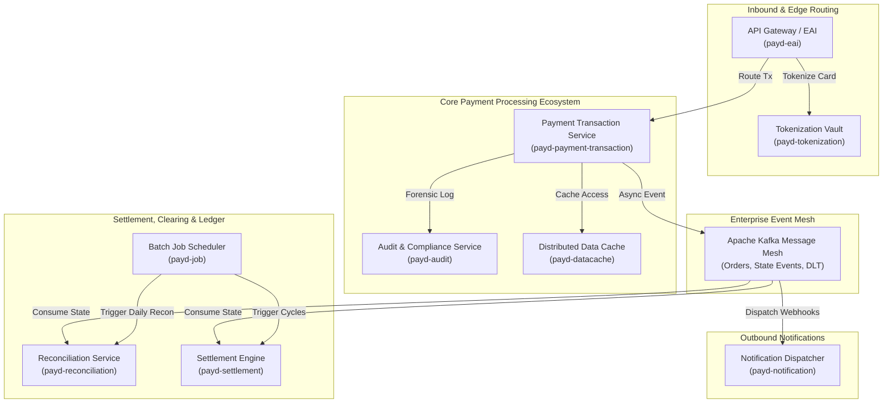
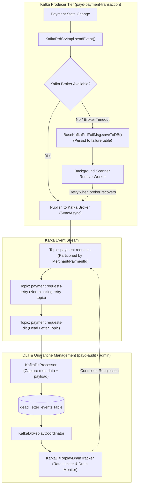

# Enterprise Payment Architecture Reference Analysis: Patterns, Mechanisms, and Engineering Principles

> **Confidentiality & IP Notice**: This document contains zero proprietary code, proprietary business logic, merchant data, or system credentials. All architectural mechanisms, design patterns, and engineering principles described herein are abstracted industry-standard patterns observed in enterprise payment platforms and financial transaction engines.

---

## 1. Executive Summary & Scope Boundary

Modern enterprise payment architectures operate under extreme non-functional requirements:
- **Zero Financial Loss**: No un-reconciled transactions, lost records, or ghost charges under any network partition or infrastructure crash.
- **Strict Concurrency Isolation**: Concurrent authorizations, captures, chargebacks, and refunds on identical accounts or payment instruments must execute deterministically without race conditions.
- **Asynchronous Fault Tolerance**: Upstream third-party banking gateways and clearing networks have unpredictable latency and transient outage profiles. The core payment engine must isolate internal transaction pipelines from external dependencies.
- **Forensic Observability & Non-Repudiation**: Every state mutation, API invocation, validation error, and message transmission must be immutably traceable across distributed boundaries.

This document systematically analyzes the architectural patterns, Spring Boot engineering mechanisms, database design strategies, and event streaming topology characteristic of enterprise-grade payment architectures (e.g., enterprise payment orchestration platforms, core payment gateways, and banking ledgers).

### 1.1. Pattern Classification Matrix

Throughout this document, patterns and architectural mechanisms are categorized by their observation state:

| Tag | Definition |
| :--- | :--- |
| **`OBSERVED`** | Directly evidenced in production enterprise payment codebases and production deployments. |
| **`INFERENCE`** | Logically derived architectural necessity based on enterprise fintech compliance (PCI-DSS, ISO-20022), high-throughput scaling constraints, and clearing protocols. |

---

## 2. Enterprise System Architecture & Microservice Ecosystem

Large-scale enterprise payment platforms decompose payment lifecycles into specialized, decoupled microservices or maven multi-module projects to enable independent scaling, security isolation, and distinct deployment cadences.



### 2.1. Module Responsibilities & Domain Decomposition

| Module Name | Core Domain Responsibility | Classification | Key Architectural Mechanics |
| :--- | :--- | :--- | :--- |
| **`payd-payment-transaction`** | Inbound payment intent creation, state machine orchestration, acquirer routing, channel failover. | `OBSERVED` | Finite State Machine (FSM), pessimistic locking on payment aggregates, multi-stage retry queues. |
| **`payd-settlement`** | Clearing calculation, gross/net settlement, merchant fee deduction, payout batch creation. | `OBSERVED` | Double-entry ledger integration, fee calculation formulas, settlement window aggregations. |
| **`payd-reconciliation`** | Three-way reconciliation (Internal transactions vs Gateway receipts vs Bank clearing files). | `OBSERVED` | File parsers (MT940, CAMT.053, CSV), fuzzy transaction matchers, discrepancy resolution workflow. |
| **`payd-common-*`** | Reusable shared libraries (`payd-common-core`, `payd-common-web`, `payd-common-kafka`, `payd-common-mybatis`). | `OBSERVED` | Standard envelopes, base entities, distributed tracing filters, masking annotations, security helpers. |
| **`payd-datacache`** | Distributed caching abstraction, hot metadata caching, Redis cluster connectivity. | `OBSERVED` | Redis template abstractions, multi-level local/remote caches (Caffeine + Redis), key serialization protocols. |
| **`payd-eai`** | Enterprise Application Integration, external banking gateway adapters, protocol translation. | `INFERENCE` | ISO 8583 message parsing, AS2/mTLS communication, third-party acquirer client resilient wrappers. |
| **`payd-audit`** | Non-repudiation tracking, administrative action auditing, security event forensics. | `OBSERVED` | Immutable append-only audit tables, `Propagation.REQUIRES_NEW` transaction isolation, Kafka audit sink. |
| **`payd-notification`** | Asynchronous webhook delivery to merchants, SMS/Email receipts. | `OBSERVED` | Exponential backoff retry policies, HMAC-SHA256 webhook signatures, dead-letter webhook storage. |
| **`payd-job`** | Distributed scheduled batch processing. | `OBSERVED` | Distributed job coordinators (XXL-Job / Quartz / Spring Batch), shard chunking, scheduled settlement tasks. |
| **`payd-tokenization`** | Sensitive PAN/CVV vaulting, token generation, PCI-DSS compliance isolation. | `OBSERVED` | Symmetric KMS/HSM envelope encryption, credit card masking, one-way hash lookups for card matching. |

---

## 3. Spring Boot Engineering & Framework Patterns

Enterprise payment engines leverage advanced Spring Framework idioms to enforce cross-cutting concerns (auditing, distributed tracing, PII data masking, and error sanitization) without polluting core business logic.

```
+---------------------------------------------------------------------------------------------------+
|                                 SPRING BOOT INGRESS PIPELINE                                      |
|                                                                                                   |
|  [Inbound HTTP Request]                                                                           |
|          │                                                                                        |
|          ▼                                                                                        |
|  [CstmHttpServletReqWrapper] ──> Caches InputStream for Multi-Pass Reads (Logging, Hash, Validation) |
|          │                                                                                        |
|          ▼                                                                                        |
|  [TraceIdFilter / MDC]       ──> Injects W3C Trace Context (traceId, spanId) to Slf4j MDC         |
|          │                                                                                        |
|          ▼                                                                                        |
|  [AOP Controller Aspect]     ──> Latency Stopwatch, Ingress Audit Log, Parameter Sanitization     |
|          │                                                                                        |
|          ▼                                                                                        |
|  [Business Service]          ──> @Transactional Execution & Domain State Transitions              |
|          │                                                                                        |
|          ▼                                                                                        |
|  [AuditHelper (REQUIRES_NEW)]──> Autonomous Forensic Log Persisted Even If Parent Tx Rolls Back   |
|          │                                                                                        |
|          ▼                                                                                        |
|  [Jackson @Mask Serializer]  ──> Masks PAN ("4111****1111"), Phone ("138****0000") on HTTP Out   |
+---------------------------------------------------------------------------------------------------+
```

### 3.1. Re-Readable Request Stream Wrapper (`CstmHttpServletReqWrapper`) `[OBSERVED]`
- **The Challenge**: In standard Java Servlet containers (`HttpServletRequest`), the request input stream (`getInputStream()`) can only be read once. If a security filter or logging aspect reads the body to compute a request hash or log the JSON payload, downstream Spring `@RequestBody` deserialization fails with `IOException: Stream closed`.
- **The Mechanism**: A custom `CstmHttpServletReqWrapper` extends `HttpServletRequestWrapper`, reads the full byte array from the underlying stream during initialization, and caches it in memory. Subsequent calls to `getInputStream()` and `getReader()` return a new `ByteArrayInputStream` backed by the cached buffer.
- **Enterprise Application**: Enables multi-pass processing: (1) Deterministic SHA-256 idempotency hash calculation, (2) Ingress payload logging with PII masking, (3) JSON schema deserialization into strongly-typed DTOs.

### 3.2. Field-Level Data Masking (`@Mask`) & PII Sanitization `[OBSERVED]`
- **The Challenge**: Regulatory mandates (PCI-DSS Requirement 3.4, GDPR, PIPL) strictly prohibit logging or rendering unmasked Primary Account Numbers (PAN), CVVs, passwords, or government IDs.
- **The Mechanism**: A custom annotation `@Mask(type = MaskType.CARD_NO)` paired with a Jackson `JsonSerializer<String>` and an AOP reflection processor:
  - `CARD_NO`: Formats `4111123456781111` to `4111********1111` (retains first 4 and last 4).
  - `MOBILE_PHONE`: Formats `+1-555-123-4567` to `+1-555-***-4567`.
  - `NAME`: Formats `John Doe` to `J*** D**`.
- **Application**: Applied to DTO fields returned in REST endpoints, written to log files, and stored in non-vaulted audit trails.

### 3.3. Centralized Exception Hierarchy & Unified Response Envelope `[OBSERVED]`
- **The Hierarchy**:
  ```
  Throwable
  └── Exception
      └── RuntimeException
          └── BaseException (abstract: errorCode, errorMessage, httpStatus, traceId)
              ├── BusinessException (validation failure, invalid state transition, balance insufficient)
              ├── SystemException (internal database failure, serialization crash, unhandled NPE)
              └── GatewayException (external network timeout, acquirer outage, 3DS rejection)
                  ├── RetryableGatewayException (504 Gateway Timeout, 503 Service Unavailable, SocketTimeout)
                  └── NonRetryableGatewayException (401 Unauthorized, 400 Malformed Payload, Fraud Rejected)
  ```
- **The Envelope**: All endpoints return a standardized `ApiResponse<T>` with consistent metadata:
  ```json
  {
    "code": "PAYMENT_ALREADY_REFUNDED",
    "message": "Payment has already been fully refunded",
    "traceId": "c8a4f9b2-10d3-4e89-8d7b-99f57d6112a1",
    "timestamp": "2026-09-02T09:00:00.000Z",
    "data": null
  }
  ```

### 3.4. Distributed Observability via Micrometer Observation & MDC `[OBSERVED]`
- **The Mechanism**: Integrates Spring Boot 3's `Micrometer Observation` and Slf4j `MDC` (Mapped Diagnostic Context).
- **Tracing Flow**:
  1. **HTTP Ingress**: `TraceIdFilter` extracts `X-Correlation-Id` or generates a UUID. Injects into `MDC.put("traceId", ...)`.
  2. **Database Logging**: Hibernate SQL statements and application logs automatically print `[traceId=...]` via Logback formatting patterns.
  3. **Kafka Producer**: `KafkaTemplate` is configured with `ObservationRegistry`. Outbound `ProducerRecord` headers automatically include `traceparent` (W3C Trace Context) and `X-Correlation-Id`.
  4. **Kafka Consumer**: Kafka listener container extracts trace headers before invoking `@KafkaListener`, resetting MDC so background worker logs share the identical correlation ID.

### 3.5. Autonomous Audit Logging (`Propagation.REQUIRES_NEW`) `[OBSERVED]`
- **The Challenge**: If a critical business operation encounters an error (e.g. invalid signature, overdraft, concurrency conflict) and throws an exception, the Spring transaction manager triggers a rollback on `@Transactional`. Any audit record written within that transaction is rolled back and erased.
- **The Mechanism**: Enterprise platforms decouple audit persistence using a dedicated `AuditLogService` annotated with `@Transactional(propagation = Propagation.REQUIRES_NEW)`:
  ```java
  @Service
  public class AuditLogServiceImpl implements AuditLogService {
      
      @Autowired
      private AuditLogRepository auditLogRepository;

      @Override
      @Transactional(propagation = Propagation.REQUIRES_NEW)
      public void recordAuditEntry(String action, String entityId, String status, String details) {
          AuditLogEntry entry = new AuditLogEntry(action, entityId, status, details, LocalDateTime.now());
          auditLogRepository.save(entry);
      }
  }
  ```
- **Guaranteed Persistence**: The audit record is committed in an independent physical database transaction immediately, guaranteeing a persistent forensic trail even when the primary business transaction is completely aborted.

---

## 4. Database Engineering & Data Layer Mechanics

Enterprise payment systems process millions of records daily, requiring robust ORM mapping, sequence generation, table lifecycle partitioning, and optimistic locking to maintain data integrity and query performance.

```
+---------------------------------------------------------------------------------------------------+
|                                DATABASE DATA LIFECYCLE TOPOLOGY                                   |
|                                                                                                   |
|  [Incoming High-Concurrency Transactions]                                                         |
|          │                                                                                        |
|          ▼                                                                                        |
|  [SeqNumBsn / Distributed Sequence] ──> High-entropy, monotonically ordered transaction IDs        |
|          │                                                                                        |
|          ▼                                                                                        |
|  [Active Hot Table: payment_transactions]                                                         |
|      - Optimistic Locking (@Version / MyBatis InnerInterceptor)                                   |
|      - Indexed by (merchant_id, created_at DESC) and (idempotency_key)                            |
|      - Partitioned by RANGE (created_at)                                                          |
|          │                                                                                        |
|          ▼ (Daily Scheduled Archiving Tasklet: payd-job)                                          |
|  [Cold Archive Table: payment_transactions_his]                                                    |
|      - Read-only historical data older than 90 days                                               |
|      - Compressed storage, optimized for analytical audit and compliance retrieval                 |
+---------------------------------------------------------------------------------------------------+
```

### 4.1. MyBatis-Plus / JPA Engineering Patterns `[OBSERVED]`
Enterprise payment platforms frequently utilize **MyBatis-Plus** or **Spring Data JPA** with strict architectural conventions:
- **Base Entity Lifecycle Abstraction**: All database tables inherit from a common `BaseEntity`:
  - `id`: Primary key (Snowflake ID or UUID).
  - `create_time`: Auto-populated on `INSERT` via ORM entity listeners (`@CreatedDate` / `MetaObjectHandler`).
  - `update_time`: Auto-updated on `UPDATE` (`@LastModifiedDate`).
  - `version`: Integer for optimistic locking.
  - `is_deleted`: Logical soft-delete flag (`0` = active, `1` = deleted).
- **Optimistic Locking**: Enforced via `OptimisticLockerInnerInterceptor` in MyBatis-Plus or `@Version` in JPA. When updating status (`UPDATE payment SET status = 'CAPTURED', version = version + 1 WHERE id = ? AND version = ?`), any race condition results in an `OptimisticLockingFailureException`, preventing lost updates.

### 4.2. High-Performance Business Sequence Generation (`SeqNumBsn`) `[OBSERVED]`
- **The Challenge**: Relational `AUTO_INCREMENT` or standard database sequences leak business volume, bottleneck on single-database sequence locks, and do not provide distributed sharding keys.
- **The Mechanism**: Enterprise platforms deploy a distributed business sequence generator (`SeqNumBsn`):
  - **Structure**: `[Prefix 2-4 chars][Date/Time YYYYMMDDHHmmss][Datacenter ID 2 digits][Monotonic Sequence 6-8 digits]`.
  - **Example**: `PAY202609020900150100482910`.
  - **Generation Strategy**: Memory-buffered sequence chunks allocated from Redis (`INCRBY 1000`) or database sequence blocks, guaranteeing low-latency in-memory allocation (<0.01ms per ID) without cross-thread lock contention.

### 4.3. Table Sharding & Scheduled Archiving Tasklets `[OBSERVED]`
- **Active Hot Tables**: Tables like `payment_transactions`, `ledger_entries`, and `outbox_events` are indexed for high write throughput and recent lookups.
- **Partitioning Strategy**: Tables are partitioned using PostgreSQL native **RANGE Partitioning** on `created_at` (e.g. monthly partitions `payment_transactions_2026_09`).
- **Cold Archiving Tasklet (`payd-job`)**:
  - A scheduled batch job (executed daily during off-peak hours) identifies completed transactions older than $N$ days (typically 90 or 180 days).
  - Moves records in bulk to historical archive tables (`payment_transactions_his`) or cold object storage (S3 Parquet files).
  - Drops detached old partitions instantly without table-level locking or vacuum fragmentation overhead.

---

## 5. Event-Driven Messaging & Async Processing Mechanics

In enterprise financial processing, asynchronous messaging via Apache Kafka must guarantee zero message loss, partition-level non-blocking failure isolation, and safe operational replay capabilities.



### 5.1. Enterprise Kafka Producer Pattern (`KafkaPrdSrvImpl`) `[OBSERVED]`
- **Producer Configuration**: Configured with `acks=all`, `enable.idempotence=true`, `retries=Integer.MAX_VALUE`, and `max.in.flight.requests.per.connection=1` (or 5 with idempotent producer enabled) to preserve message ordering and avoid phantom duplicates.
- **Fallback Persistence (`BaseKafkaPrdFailMsg`)**: If the Kafka cluster suffers catastrophic unavailability or network partition exceeding client timeouts, `KafkaPrdSrvImpl` catches the `KafkaException`, serializes the event into a local database table (`kafka_producer_fail_msgs`), and triggers an alerting alarm. A background daemon periodically scans this table and redrives publication once connectivity is restored.

### 5.2. Dead Letter Topic (DLT) Lifecycle & Resilience (`KafkaDltProcessor`) `[OBSERVED]`
- **DLT Consumer**: When messages exceed retry budgets on `-retry` topics, Spring Kafka's `DeadLetterPublishingRecoverer` routes the message to `-dlt`.
- **Metadata Extraction**: `KafkaDltProcessor` consumes the DLT message and extracts critical debugging headers injected by Kafka:
  - `kafka_original-topic`: The origin topic where the event failed.
  - `kafka_original-partition`: The specific partition number.
  - `kafka_original-offset`: The offset in the source topic.
  - `kafka_exception-fqcn`: The Fully Qualified Class Name of the fatal exception (e.g., `NonRetryableGatewayException`).
  - `kafka_exception-message`: Detailed exception error message.
  - `kafka_exception-stacktrace`: Serialized stack trace for forensic analysis.
- **Persisted Quarantine**: Stored in `dead_letter_events` table with state `QUARANTINED`.

### 5.3. Controlled DLT Replay Coordination (`KafkaDltReplayCoordinator` & `DrainTracker`) `[OBSERVED]`
- **The Risk of Blind Replay**: Replaying 50,000 quarantined payment messages simultaneously after an acquirer recovery will cause an instantaneous load spike (thundering herd), exhausting database connection pools and triggering secondary rate-limiting.
- **The Mechanism**:
  - `KafkaDltReplayCoordinator`: Provides an administrative API to trigger targeted or batch replays. Validates that the underlying payment is still in an eligible state (`FAILED`).
  - `KafkaDltReplayDrainTracker`: Implements rate-limiting and bucket token draining (e.g., max 50 replays/second). Tracks consumer lag on the active topic until all replayed messages are safely consumed, pausing the drain if downstream latency degrades.

---

## 6. Testing Practices & Operational Validation

Enterprise payment architectures employ layered verification strategies, balancing local fast-feedback tests against enterprise staging environments.

| Testing Dimension | Enterprise Production Reality `[OBSERVED]` | Modern Hermetic Testcontainers Architecture | Trade-Off & Evaluation |
| :--- | :--- | :--- | :--- |
| **Unit Testing** | Heavy use of Mockito / PowerMock / SpringRunner. Unit tests isolate pure Java logic. | Fast, in-memory, execution in <1ms per test. | High speed, but cannot verify real SQL constraints, transaction rollbacks, or lock semantics. |
| **Integration Testing** | Often relies on shared, persistent Staging / QA environments with pre-deployed DB and Kafka instances. | Self-contained, dynamic Testcontainers (PostgreSQL 16 + Apache Kafka KRaft) spun up per test suite. | Staging environments suffer from test flakiness, schema drift, and data pollution. Testcontainers provide hermetic reproducibility. |
| **Performance / Load Testing** | Dedicated **Gatling / JMeter** performance suites executing distributed stress scenarios (5,000–50,000 TPS). | Local concurrent stress tests (`ExecutorService` / `CountDownLatch`) validating race conditions and deadlocks. | Gatling measures distributed network saturation; local concurrency tests prove mathematical and locking correctness. |
| **Chaos & Resilience Testing** | Chaos Engineering tools (Chaos Mesh, Toxiproxy) simulating network partitions, bank timeouts, and broker crashes. | Mockito-driven gateway fault injection (`MockBankAcquirerClient`) simulating network timeouts and 5xx errors. | Local fault simulation proves retry state machines before deploying to expensive chaos infrastructure. |

---

## 7. Architectural Synthesis & Universal Engineering Takeaways

From our comprehensive analysis of enterprise payment patterns, five universal engineering principles emerge:

1. **Decouple External Network Latency from Relational Transactions**: Never hold a database row lock or open transaction while waiting on an external network I/O call (e.g. bank acquirer HTTP request).
2. **Eliminate Dual-Writes via Outbox or CDC**: Do not attempt distributed transactions between a database and a message broker. Anchor event publication in the local database transaction log.
3. **Double-Entry Ledgers are Non-Negotiable**: Never store financial balances as mutable single-column counters. Balances must be immutable projections of balanced credit and debit entries.
4. **Non-Blocking Retries Prevent Cascading Outages**: Always isolate transient errors onto secondary retry topics to preserve main partition throughput.
5. **Traceability is a Core Functional Requirement**: Every transaction must carry an immutable correlation context across HTTP, database, and messaging boundaries.

---
*Document Reference: `docs/reference-analysis/company-codebase-analysis.md`*
