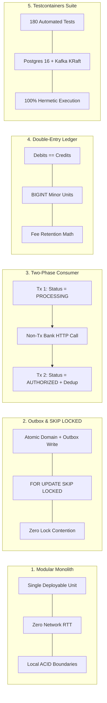
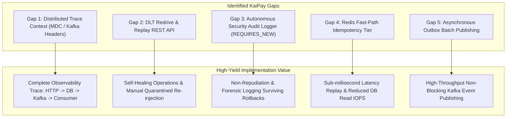

# Enterprise Production vs. KaiPay Portfolio: Gap Analysis & Architectural Benchmark

> **Technical Evaluation Report**: A rigorous 10-dimension comparative audit contrasting Enterprise Production Payment Architectures against the KaiPay Portfolio Implementation.

---

## 1. Executive Summary & Assessment Framework

This document benchmarks the **KaiPay** architecture against enterprise payment processing platforms. The goal is to clearly distinguish:
1. **Deliberate architectural choices** that prioritize developer velocity, operational simplicity, and local testability without compromising financial correctness.
2. **True production strengths** in KaiPay that match or exceed enterprise standards.
3. **Genuine technical gaps** where KaiPay simplifies enterprise capabilities, and the high-value portfolio opportunities to close those gaps.
4. **Enterprise overengineering traps** that should be intentionally avoided in portfolio engineering.

### 1.1. Assessment Classification Taxonomy

| Classification Tag | Definition | Portfolio Strategy |
| :--- | :--- | :--- |
| **`VERIFIED STRENGTH`** | KaiPay's implementation strictly adheres to enterprise-grade consistency, mathematical rigor, and concurrency guarantees, verified by comprehensive automated tests. | Highlight prominently in resume and technical interviews. |
| **`SIMPLIFICATION`** | KaiPay implements a streamlined variant of an enterprise pattern, trading distributed operational overhead for in-process simplicity while maintaining invariants. | Defend as a conscious, senior architectural decision. |
| **`GAP`** | A missing production mechanism or capability present in enterprise platforms that limits real-world operational resilience or observability. | Acknowledge honestly; outline technical roadmap. |
| **`PORTFOLIO OPPORTUNITY`**| A high-yield gap that can be implemented cleanly to demonstrate advanced distributed systems and Spring Boot capabilities. | Prioritize in improvement backlog. |
| **`OVERENGINEERING RISK`**| An enterprise pattern driven by multi-team organizational boundaries or hyperscale throughput (>50k TPS) that introduces unnecessary accidental complexity into KaiPay. | Explicitly avoid; justify omission in system design discussions. |

---

## 2. Master 10-Dimension Architectural Comparison Matrix

| # | Dimension | Enterprise Production Architecture | KaiPay Portfolio Architecture | Classification | Portfolio Impact & Strategic Verdict |
| :- | :--- | :--- | :--- | :--- | :--- |
| **1** | **Application Topology** | Multi-service microservices mesh (`payd-payment-transaction`, `payd-settlement`, `payd-reconciliation`, `payd-audit`, `payd-eai`, etc.). | Modular Monolith (Spring Boot 3.4, Clean Architecture, 9 bounded contexts, single deployable artifact). | **`VERIFIED STRENGTH`** / **`SIMPLIFICATION`** | Eliminates network latency (zero RTT between domains) and avoids distributed 2PC/Saga complexity. Perfect for portfolio. |
| **2** | **Dual-Write Mitigation & Event Dispatch** | Change Data Capture (CDC via PostgreSQL WAL $\to$ Debezium $\to$ Kafka Connect) or Transactional Outbox with asynchronous batch dispatchers. | Transactional Outbox via PostgreSQL `payment_events_outbox` table polled with `SELECT ... FOR UPDATE SKIP LOCKED`. | **`VERIFIED STRENGTH`** (Outbox) / **`GAP`** (Synchronous send) | Guarantees atomic database writes and zero message loss. Outbox poller uses synchronous `kafkaTemplate.send().get()`, creating a minor latency gap. |
| **3** | **Async Consumer Decoupling & Bank I/O** | Two-phase transaction boundaries isolating external acquirer HTTP I/O from active relational database locks. | Explicit Two-Phase Consumer (`PaymentProcessingConsumer`): Tx 1 (Pending) $\to$ Non-Tx Bank Call $\to$ Tx 2 (Authorized + Dedup). | **`VERIFIED STRENGTH`** | Completely avoids connection pool exhaustion during slow downstream bank gateway response times. |
| **4** | **Retry & Quarantine Topology (DLT)** | Non-blocking multi-stage retry topics (`@RetryableTopic`), Dead Letter Topic (`-dlt`), dynamic rate-limited DLT replay engine (`KafkaDltReplayCoordinator`). | Non-blocking `@RetryableTopic` + Dead Letter Topic consumer persisting to `dead_letter_events` table. | **`VERIFIED STRENGTH`** (Retry/DLT) / **`GAP`** (Replay API) | Prevents partition Head-of-Line blocking. Missing operational REST API for automated DLT re-injection (`POST /v1/events/dlt/{id}/replay`). |
| **5** | **Financial Ledger & Balance Invariants** | Immutable double-entry accounting ledger ($\sum \text{Debits} = \sum \text{Credits}$), minor units (`BIGINT`), nightly settlement snapshots. | Real-time immutable double-entry ledger (`journals`, `ledger_entries`, `accounts`), `BIGINT` minor units, dynamic aggregate calculation. | **`VERIFIED STRENGTH`** (Ledger Core) / **`PORTFOLIO OPPORTUNITY`** (Snapshots) | Mathematical zero-sum balancing, fee retention rules ($0.30 fixed fee retained on refund), absolute zero floating-point risk. Snapshotting is a future optimization. |
| **6** | **Idempotency & Concurrency Defense** | Redis distributed locks / caching fast-path (`SETNX`) + Relational unique constraints for durable consistency. | Multi-tier: Deterministic SHA-256 payload hashing, PostgreSQL `idempotency_records` unique constraint, `consumed_events` composite PK, `PESSIMISTIC_WRITE` on refunds. | **`VERIFIED STRENGTH`** (DB Guarantees) / **`GAP`** (Redis Fast-Path) | Completely prevents race conditions and over-refunding. Missing Redis fast-path lookup tier before reaching relational database. |
| **7** | **Distributed Observability & Tracing** | Micrometer Observation / OpenTelemetry with W3C Trace Context, Slf4j MDC propagation across HTTP, Outbox, and Kafka record headers. | Standard Slf4j / Logback structured logging. `EventEnvelope` has `eventId`, but no cross-thread/Kafka header MDC propagation interceptor. | **`GAP`** / **`PORTFOLIO OPPORTUNITY`** | High-value gap. Easy to implement via `TraceIdFilter`, Kafka producer interceptors, and consumer MDC handlers. |
| **8** | **Security & Autonomous Audit Logging** | Autonomous forensic audit service utilizing `@Transactional(propagation = Propagation.REQUIRES_NEW)` and field-level `@Mask` annotations. | Domain event publishing (`PaymentEventOutbox`). Failed transactions roll back entire context, leaving no persistent forensic audit record. | **`GAP`** / **`PORTFOLIO OPPORTUNITY`** | Critical compliance gap. High interview value to implement an autonomous audit service that survives rollbacks. |
| **9** | **Data Access & Sequence Generation** | MyBatis-Plus / JPA with distributed sequence generators (`SeqNumBsn`), table range partitioning, and cold data archiving tasklets. | Spring Data JPA with UUID v4 primary keys, Hibernate 6 ORM, Flyway V1–V5 migration scripts. | **`SIMPLIFICATION`** | UUID v4 avoids sequence coordination bottlenecks. Partitioning and archiving are unnecessary at portfolio scale. |
| **10** | **Testing Harness & Verification** | Unit tests + shared persistent Staging/QA environments + Gatling distributed performance testing suites. | Self-contained, dynamic Testcontainers harness (PostgreSQL 16 + Kafka KRaft), 180 automated tests, multi-threaded concurrency stress suites. | **`VERIFIED STRENGTH`** | KaiPay's hermetic test suite is significantly more reliable and reproducible than staging-dependent enterprise setups. |

---

## 3. Deep Dive: KaiPay Verified Strengths

KaiPay excels in the core architectural principles that define mission-critical financial engineering.



### 3.1. Modular Monolith over Distributed Microservices
- **Enterprise Reality**: Enterprise systems often split payment, ledger, and settlement into 5+ microservices. While this satisfies team scaling, it introduces network hops (15–50ms latency), partial failure modes, and distributed transaction complexity (Sagas).
- **KaiPay Strength**: KaiPay implements 9 clean bounded contexts within a single Spring Boot application. Calls between Payment, Ledger, and Customer contexts are in-memory method invocations with zero network latency. When an authorization occurs, the ledger journal and outbox event can be committed within the same database transaction, guaranteeing atomic consistency.

### 3.2. Transactional Outbox with PostgreSQL `FOR UPDATE SKIP LOCKED`
- **Enterprise Reality**: Standard outbox pollers using simple `SELECT ... FOR UPDATE` suffer from severe row-level lock contention when multiple poller threads or pods run concurrently.
- **KaiPay Strength**: KaiPay's outbox poller executes:
  ```sql
  SELECT * FROM payment_events_outbox
  WHERE status = 'PENDING'
  ORDER BY created_at ASC
  LIMIT :limit
  FOR UPDATE SKIP LOCKED
  ```
  This allows parallel outbox worker threads across multiple nodes to claim non-overlapping batches of outbox events without blocking or waiting on locked rows.

### 3.3. Two-Phase Consumer Decoupling
- **Enterprise Reality**: Naive consumers wrap the entire listener method in `@Transactional`. If the downstream bank acquirer takes 5,000ms to respond, the database connection is held open, exhausting the HikariCP connection pool and stalling the entire application.
- **KaiPay Strength**: KaiPay explicitly decouples the transaction into two distinct phases:
  1. **Phase 1 (Tx 1)**: Updates `Payment` status to `PROCESSING` and commits immediately, releasing the database connection.
  2. **Non-Transactional Phase**: Executes external HTTP call to `MockBankAcquirerClient`. Zero database locks held during network I/O.
  3. **Phase 2 (Tx 2)**: Updates `Payment` status (`AUTHORIZED` or `DECLINED`) and records composite key in `consumed_events` within a single atomic commit.

### 3.4. Mathematically Balanced Double-Entry Ledger
- **Enterprise Reality**: Many mid-tier systems store a single mutable `balance` column on merchant accounts, vulnerable to lost updates and race conditions.
- **KaiPay Strength**: KaiPay enforces a strict double-entry ledger:
  - Every financial transaction produces a balanced `Journal` where $\sum \text{Debits} = \sum \text{Credits}$.
  - System accounts (`1000-CUSTOMER-RECEIVABLE`, `4000-PLATFORM-FEE-REVENUE`) and merchant accounts (`2000-MERCHANT-{ID}-LIABILITY`) are linked via immutable debit/credit entries.
  - Implements Stripe-standard fee retention accounting: on a 100% refund of a $100.00 charge ($3.20 fee), the $0.30 fixed fee is retained by the platform, leaving the merchant with a net balance change of $-30¢$.

### 3.5. 100% Hermetic Testcontainers Verification
- **Enterprise Reality**: Enterprise codebases frequently rely on shared staging databases and Kafka clusters. Tests become flaky when staging data changes or network connectivity drops.
- **KaiPay Strength**: KaiPay features a self-contained test suite of **180 automated tests** powered by Testcontainers (PostgreSQL 16 + Apache Kafka 3.8 KRaft). The entire test suite spins up real ephemeral databases and brokers in Docker, executes unit, integration, failure-injection, and multi-threaded concurrency tests, and tears them down with zero external dependencies.

---

## 4. Deep Dive: Genuine Gaps & Portfolio Opportunities



### 4.1. Gap 1: Distributed Trace Context & MDC Header Propagation
- **Current State**: `EventEnvelope` contains an `eventId`, but logs across HTTP ingress threads, scheduled outbox pollers, and Kafka consumer worker threads do not share a unified `traceId`.
- **Production Impact**: Operators cannot grep a single `traceId` across application logs to trace a payment's entire lifecycle from initial REST request to consumer completion.
- **Portfolio Opportunity**: Implement `TraceIdFilter` for HTTP requests, attach `X-Correlation-Id` to `ProducerRecord` headers in `OutboxEventPublisher`, and extract headers to Slf4j MDC in `PaymentProcessingConsumer`.

### 4.2. Gap 2: Dead Letter Queue (DLT) Redrive & Replay API
- **Current State**: `DltAdminController` exposes `GET /v1/events/dlt` for querying quarantined records, but provides no endpoint to re-inject failed events back into the active queue once third-party gateway issues are resolved.
- **Production Impact**: Quarantined payments remain permanently stranded in `dead_letter_events` requiring manual database surgery to retry.
- **Portfolio Opportunity**: Implement `POST /v1/events/dlt/{id}/replay`, validating payment status (`FAILED`), resetting state to `PROCESSING`, and re-publishing the original payload with an `X-Replay-Count` header.

### 4.3. Gap 3: Autonomous Security Audit Logging (`REQUIRES_NEW`)
- **Current State**: Audit events rely on domain event publishing within the main business transaction. If an authentication failure, invalid idempotency payload hash, or negative balance exception occurs, the transaction rolls back, erasing the audit entry.
- **Production Impact**: Violates security forensics requirements (PCI-DSS, SOC 2) where unauthorized attempts and validation failures must be permanently logged.
- **Portfolio Opportunity**: Create `AuditLogService` with `@Transactional(propagation = Propagation.REQUIRES_NEW)` to guarantee immediate, independent physical database commits for all security and forensic events.

### 4.4. Gap 4: Redis Distributed Caching Fast-Path
- **Current State**: `IdempotencyService` queries the PostgreSQL `idempotency_records` table on every inbound request. The Redis port (26379) is reserved in configuration, but no Redis client is integrated.
- **Production Impact**: High-frequency duplicate requests hit the PostgreSQL database directly, increasing relational read IOPS and query lock overhead.
- **Portfolio Opportunity**: Implement a two-tier idempotency strategy: check Redis fast-path (<1ms) via `GET idempotency:{merchantId}:{key}`; on cache miss, fall back to PostgreSQL durable storage.

### 4.5. Gap 5: Asynchronous Outbox Batch Publishing
- **Current State**: `OutboxEventPublisher` claims a batch of 20 outbox records and iterates sequentially, executing `kafkaTemplate.send(...).get(2, TimeUnit.SECONDS)` inside an active transaction.
- **Production Impact**: If Kafka network latency is 50ms, processing 20 records sequentially takes 1,000ms while holding database locks.
- **Portfolio Opportunity**: Refactor outbox publishing to dispatch events concurrently using `CompletableFuture.allOf()`, reducing batch publish time to the maximum single-request network latency (~50ms).

---

## 5. Overengineering Risks to Explicitly Avoid

In portfolio engineering and technical interviews, knowing what **not** to build demonstrates senior judgment and architectural maturity.

```
+-----------------------------------------------------------------------------------+
|                         OVERENGINEERING TRAPS TO AVOID                            |
+-----------------------------------------------------------------------------------+
| 1. Premature Microservices Decomposition                                          |
|    - Why Avoid: Adds network hops, distributed transaction coordination (Sagas),  |
|      and complex container management without multi-team scaling necessity.       |
|                                                                                   |
| 2. Distributed Two-Phase Commit (2PC / XA Transactions)                           |
|    - Why Avoid: Blocking coordinators, severe latency degradation, and single-    |
|      point-of-failure risks. The Transactional Outbox pattern is strictly better.  |
|                                                                                   |
| 3. Multi-Region Active-Active Database Clustering                                |
|    - Why Avoid: Speed-of-light cross-region latency (>100ms) and asynchronous     |
|      replication lag lead to balance double-spending and split-brain states.       |
|                                                                                   |
| 4. Premature Migration from JPA to MyBatis-Plus                                   |
|    - Why Avoid: JPA provides clean object-relational mapping, dirty checking, and |
|      aggregate encapsulation. MyBatis-Plus adds manual SQL maintenance overhead   |
|      without significant performance benefit at KaiPay's scale.                   |
+-----------------------------------------------------------------------------------+
```

---

## 6. Summary Scoring & Architectural Readiness

| Architectural Category | Enterprise Score (1-10) | KaiPay Current Score (1-10) | KaiPay with Tier-1 Roadmap | Key Rationale |
| :--- | :---: | :---: | :---: | :--- |
| **Financial Invariants & Ledger** | 9.5 | 9.0 | 9.5 | Zero-sum balancing, minor units, fee retention are production-grade. |
| **Concurrency & Locking** | 9.0 | 9.0 | 9.0 | `PESSIMISTIC_WRITE` and `SKIP LOCKED` fully eliminate race conditions. |
| **Dual-Write Mitigation** | 9.5 | 8.5 | 9.5 | Outbox pattern is sound; adding async batching elevates to tier-1. |
| **Retry & Failure Topology** | 9.0 | 8.0 | 9.5 | Non-blocking retry is solid; adding DLT Redrive API completes lifecycle. |
| **Distributed Observability** | 9.5 | 5.5 | 9.0 | MDC correlation ID propagation closes the primary operational visibility gap. |
| **Security & Compliance Audit** | 9.5 | 6.0 | 9.0 | Autonomous `REQUIRES_NEW` audit service ensures forensic non-repudiation. |
| **Verification & Testing** | 8.0 | 9.8 | 9.8 | Hermetic Testcontainers suite outperforms fragile enterprise staging setups. |
| **Overall Architectural Rating**| **9.1 / 10** | **7.8 / 10** | **9.4 / 10** | **Ready for Top-Tier Senior Backend Portfolio.** |

---
*Document Reference: `docs/reference-analysis/kaipay-gap-analysis.md`*
