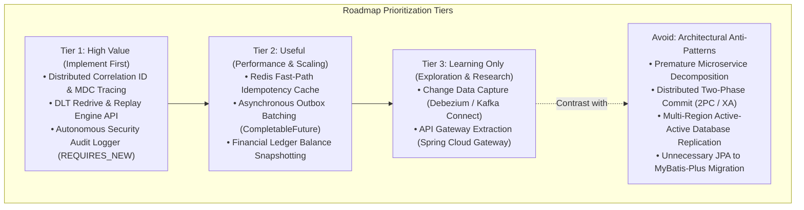
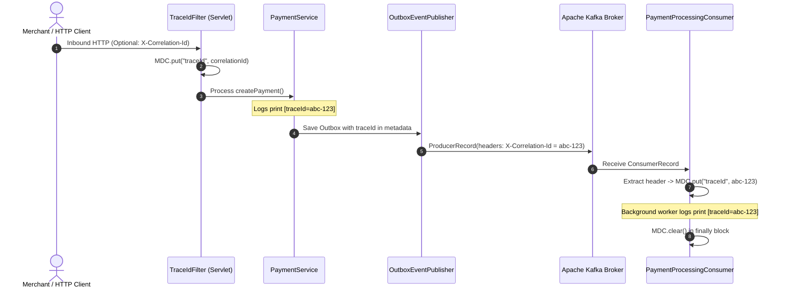
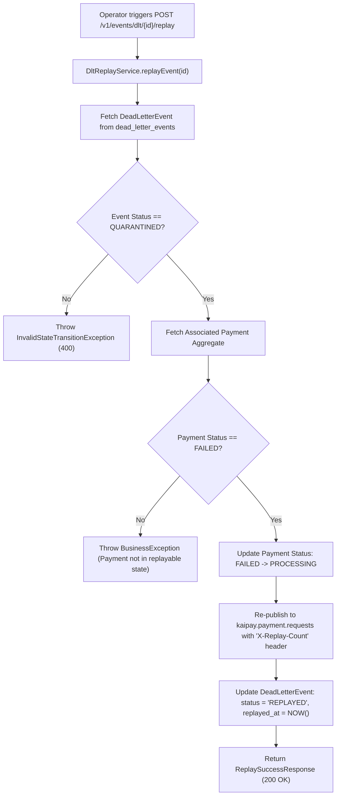
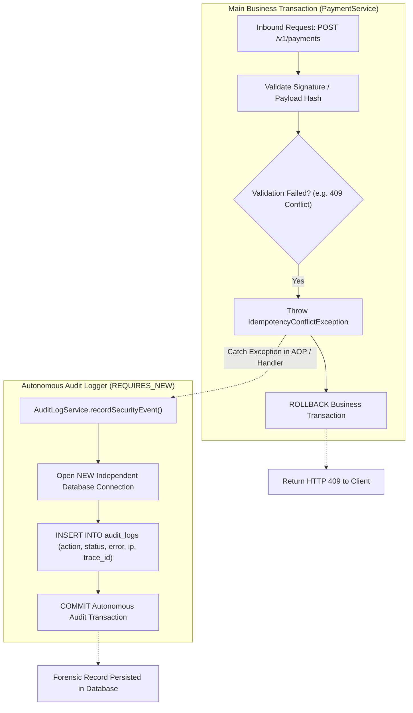
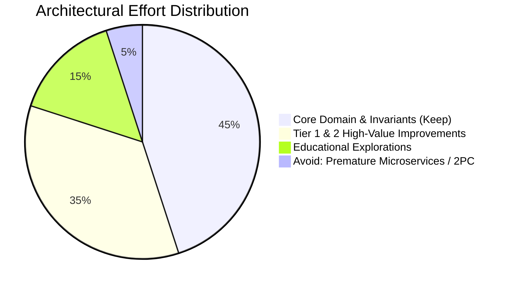

# KaiPay Architectural Improvement Roadmap: Prioritized Technical Specifications

> **Actionable Engineering Blueprint**: A prioritized technical roadmap for elevating the KaiPay platform from a high-quality portfolio system to an enterprise-grade financial transaction engine.

---

## 1. Executive Roadmap Strategy

This roadmap bridges the gap between KaiPay's current modular monolith architecture and high-scale production systems. To maximize interview impact and engineering return on investment, backlog items are prioritized into four distinct tiers:



---

## 2. Tier 1: High-Value Production Improvements

Tier 1 enhancements solve critical operational resilience, compliance, and distributed observability requirements with high resume/interview payoff.

---

### Item `ROADMAP-101`: Distributed Correlation ID & MDC Propagation across Kafka Headers



#### 1. Problem Solved
Currently, logs generated during inbound HTTP requests, scheduled outbox polling, and asynchronous Kafka consumer executions exist in isolated diagnostic silos. Operators cannot correlate an end-to-end payment flow using a single trace identifier.

#### 2. Why It Exists in Real Systems
Enterprise observability standards (OpenTelemetry, W3C Trace Context, SOC 2) require unified transaction tracing across thread boundaries, asynchronous queues, and microservices to support fast incident triage and SLA monitoring.

#### 3. Proposed KaiPay Implementation
1. **Servlet Filter (`TraceIdFilter`)**: Intercepts HTTP requests, reads `X-Correlation-Id` or generates `UUID.randomUUID().toString()`, and binds it to `MDC.put("traceId", correlationId)`. Sets response header `X-Correlation-Id`.
2. **Outbox Payload Context**: `PaymentEventOutbox` persists the `traceId` within its JSON metadata payload.
3. **Kafka Producer Header Injection**: `OutboxEventPublisher` attaches the trace identifier as a byte-array header on outbound `ProducerRecord`:
   ```java
   ProducerRecord<String, String> record = new ProducerRecord<>(topic, paymentId, payloadJson);
   record.headers().add("X-Correlation-Id", traceId.getBytes(StandardCharsets.UTF_8));
   kafkaTemplate.send(record);
   ```
4. **Kafka Consumer Header Extraction**: `PaymentProcessingConsumer` reads `@Header(name = "X-Correlation-Id", required = false)` and establishes MDC context in a `try-finally` block:
   ```java
   @KafkaListener(topics = "kaipay.payment.requests", groupId = "kaipay-payment-processing-group")
   public void handlePaymentProcessing(@Payload String payload, 
                                      @Header(name = "X-Correlation-Id", required = false) String traceId) {
       if (traceId != null) {
           MDC.put("traceId", traceId);
       }
       try {
           processPayment(payload);
       } finally {
           MDC.remove("traceId");
       }
   }
   ```

#### 4. Engineering Evaluation Matrix
- **Complexity**: Low (1–2 days).
- **Learning Value**: High (mastering Slf4j MDC, thread-local memory leak prevention, Kafka header propagation).
- **Resume / Interview Value**: High (concrete answer to "How do you trace transactions across asynchronous Kafka boundaries?").
- **Potential Risks**: Failure to clear MDC in `finally` blocks causes thread pool context leakage in shared servlet workers.

---

### Item `ROADMAP-102`: Dead Letter Queue (DLT) Redrive & Replay Engine



#### 1. Problem Solved
Currently, `DltAdminController` only supports querying quarantined dead-letter messages (`GET /v1/events/dlt`). If an upstream bank outage is resolved, there is no automated API mechanism to re-inject quarantined payments into the active processing queue.

#### 2. Why It Exists in Real Systems
Payment failures caused by transient third-party downtime must be retried after upstream recovery without requiring merchants or customers to re-initiate payments (which risks duplicate authorizations).

#### 3. Proposed KaiPay Implementation
1. **REST Endpoint**: `POST /v1/events/dlt/{id}/replay` in `DltAdminController`.
2. **State Machine Expansion**: Update `PaymentStatus` state machine to permit valid transition `FAILED -> PROCESSING` specifically during administrative replay.
3. **Replay Coordinator (`DltReplayService`)**:
   - Loads `DeadLetterEvent` by ID with row lock.
   - Validates that parent `Payment` exists and is in `FAILED` status.
   - Updates `DeadLetterEvent` status to `REPLAYED`.
   - Injects `X-Replay-Count` and `X-Original-Exception` headers into the replayed Kafka message and publishes to `kaipay.payment.requests`.
4. **Integration Test Suite**: Test case simulating: (1) Fatal gateway timeout $\to$ (2) Payment fails & enters DLT $\to$ (3) Trigger replay API $\to$ (4) Gateway succeeds $\to$ (5) Payment reaches `AUTHORIZED`.

#### 4. Engineering Evaluation Matrix
- **Complexity**: Medium (2–3 days).
- **Learning Value**: High (DLT recovery lifecycles, state machine reconciliation, idempotency during replays).
- **Resume / Interview Value**: Very High (proves end-to-end failure handling and operational self-healing).
- **Potential Risks**: Replaying messages without checking payment state could cause duplicate charges if the payment was already manually resolved.

---

### Item `ROADMAP-103`: Autonomous Security & Compliance Audit Logger (`REQUIRES_NEW`)



#### 1. Problem Solved
When a transaction encounters a business validation error (e.g. idempotency hash mismatch, invalid API key, negative balance), the primary `@Transactional` boundary rolls back. Consequently, all audit logs written within that transaction are discarded.

#### 2. Why It Exists in Real Systems
Financial regulations (PCI-DSS 10.2, SOC 2 Type II) require non-repudiation and permanent logging of all authorization failures, authentication rejections, and anomalous access attempts, regardless of whether the business transaction succeeded.

#### 3. Proposed KaiPay Implementation
1. **Database Schema (Flyway V6)**:
   ```sql
   CREATE TABLE audit_logs (
       id UUID PRIMARY KEY,
       trace_id VARCHAR(64) NOT NULL,
       merchant_id UUID,
       action VARCHAR(64) NOT NULL,
       resource_type VARCHAR(64) NOT NULL,
       resource_id VARCHAR(64),
       status VARCHAR(32) NOT NULL,
       details JSONB,
       client_ip VARCHAR(45),
       created_at TIMESTAMP WITH TIME ZONE NOT NULL DEFAULT NOW()
   );
   CREATE INDEX idx_audit_merchant_created ON audit_logs (merchant_id, created_at DESC);
   CREATE INDEX idx_audit_trace_id ON audit_logs (trace_id);
   ```
2. **Autonomous Service Component**:
   ```java
   @Service
   public class AuditLogServiceImpl implements AuditLogService {

       @Autowired
       private AuditLogRepository auditLogRepository;

       @Override
       @Transactional(propagation = Propagation.REQUIRES_NEW)
       public void recordSecurityEvent(String traceId, UUID merchantId, String action, 
                                       String status, String details) {
           AuditLog entry = AuditLog.builder()
               .id(UUID.randomUUID())
               .traceId(traceId)
               .merchantId(merchantId)
               .action(action)
               .status(status)
               .details(details)
               .createdAt(Instant.now())
               .build();
           auditLogRepository.save(entry);
       }
   }
   ```
3. **Global Exception Handler Interceptor**: `GlobalExceptionHandler` invokes `auditLogService.recordSecurityEvent(...)` before returning error responses.

#### 4. Engineering Evaluation Matrix
- **Complexity**: Low-Medium (1–2 days).
- **Learning Value**: High (deep understanding of Spring Transaction Propagation rules, connection pool allocation).
- **Resume / Interview Value**: High (demonstrates enterprise security mindset and transaction boundary mastery).
- **Potential Risks**: Suspending the outer transaction to open a `REQUIRES_NEW` transaction requires a second database connection from HikariCP. If connection pool size is too small, nested calls can cause connection pool starvation deadlocks under heavy load.

---

## 3. Tier 2: Useful Architectural & Performance Improvements

Tier 2 optimizations focus on throughput, latency reduction, and long-term ledger scalability.

---

### Item `ROADMAP-201`: Redis Distributed Idempotency Cache (Fast-Path)

```
[Inbound HTTP POST]
        │
        ▼
[Check Redis Fast-Path: GET idempotency:{merchantId}:{key}]
        ├── Hit  ──> [Validate Hash] ──> Return Cached Response (<1ms)
        └── Miss ──> [Acquire Redis Lock: SETNX lock:{merchantId}:{key} 5s]
                           │
                           ▼
                     [Execute Business Logic & Save to Postgres idempotency_records]
                           │
                           ▼
                     [Write Result to Redis: SETEX idempotency:{merchantId}:{key} 86400s]
                           │
                           ▼
                     [Release Redis Lock] ──> Return HTTP 201 Response
```

#### 1. Problem Solved
Eliminates PostgreSQL read IOPS and row-level contention on the `idempotency_records` table for frequent duplicate API calls.

#### 2. Why It Exists in Real Systems
High-volume merchants frequently retry webhook deliveries or polling requests at 100+ requests/sec. Caching completed idempotency responses in Redis offloads >95% of read queries from the primary relational database.

#### 3. Proposed KaiPay Implementation
- Wire `RedisTemplate<String, String>` to KaiPay's existing Redis container (port 26379).
- Structure cache keys: `idempotency:{merchantId}:{idempotencyKey}` with TTL = 24 hours.
- Implement two-tier lookup: Check Redis first; on miss, execute PostgreSQL query and backfill Redis.

#### 4. Evaluation
- **Complexity**: Medium. **Learning Value**: High. **Resume Value**: High.
- **Risks**: Cache inconsistency if Redis write fails after PostgreSQL commit. Mitigate by setting appropriate TTL and treating PostgreSQL as the single source of truth.

---

### Item `ROADMAP-202`: Asynchronous Outbox Batch Publishing (`CompletableFuture`)

```java
// Synchronous Poller (Current): Latency = 20 * 50ms = 1,000ms
for (PaymentEventOutbox event : pendingEvents) {
    kafkaTemplate.send(topic, event.getAggregateId(), event.getPayload()).get(2, TimeUnit.SECONDS);
    event.markPublished();
}

// Asynchronous Batch Poller (Proposed): Latency = max(50ms) = ~50ms
List<CompletableFuture<Void>> futures = pendingEvents.stream()
    .map(event -> kafkaTemplate.send(topic, event.getAggregateId(), event.getPayload())
        .thenAccept(result -> event.markPublished())
        .exceptionally(ex -> { event.markFailed(ex.getMessage()); return null; }))
    .toList();

CompletableFuture.allOf(futures.toArray(new CompletableFuture[0])).join();
outboxRepository.saveAll(pendingEvents);
```

#### 1. Problem Solved
Replaces the sequential, blocking `kafkaTemplate.send().get(2s)` loop in `OutboxEventPublisher` with concurrent non-blocking message dispatch.

#### 2. Why It Exists in Real Systems
When the outbox batch size is increased to 100 or 500 records, sequential synchronous publishing holds database transaction locks for seconds, causing outbox poller lag.

#### 3. Proposed KaiPay Implementation
- Dispatch Kafka `CompletableFuture` instances in parallel using `CompletableFuture.allOf()`.
- Collect individual send results; mark successful records as `PUBLISHED` and failed records as `FAILED` with retry backoff.

#### 4. Evaluation
- **Complexity**: Low-Medium. **Learning Value**: High. **Resume Value**: High.
- **Risks**: Unbounded thread creation. Mitigated by using Spring's managed `taskExecutor` and bounded batch sizes (e.g. 50 records).

---

### Item `ROADMAP-203`: Financial Ledger Balance Snapshotting & Settlement Archiving

#### 1. Problem Solved
`MerchantBalanceService.getMerchantBalance` currently executes `SUM(amount_cents)` dynamically across all historical `ledger_entries`. As entries exceed tens of millions, dynamic aggregation queries become slow and resource-intensive.

#### 2. Why It Exists in Real Systems
Core banking engines compute running balances by maintaining periodic account snapshots (e.g., daily midnight balance snapshots), calculating current balance as:
$$\text{Current Balance} = \text{Latest Snapshot Balance} + \sum_{\text{created} > \text{snapshot}} \text{Delta Entries}$$

#### 3. Proposed KaiPay Implementation
- Create `account_balance_snapshots` table `(account_id, snapshot_date, closing_balance_cents, last_entry_id)`.
- Scheduled job creates midnight snapshots; balance query sums entries starting from `last_entry_id` rather than table genesis.

#### 4. Evaluation
- **Complexity**: Medium. **Learning Value**: High. **Resume Value**: High.

---

## 4. Tier 3: Educational & Research Explorations

These items represent advanced infrastructure patterns suitable for study and conceptual interview discussions, but are unnecessary for the core monolith codebase.

| Project ID | Architectural Area | Implementation Concept | Educational Objective |
| :--- | :--- | :--- | :--- |
| **`ROADMAP-301`** | **Change Data Capture (CDC)** | Deploy **Debezium** reading PostgreSQL WAL directly into Kafka topics, replacing the scheduled Outbox polling worker. | Learn WAL log-miner internals, zero-polling latency event publication, and Kafka Connect architecture. |
| **`ROADMAP-302`** | **API Gateway Extraction** | Extract edge routing into **Spring Cloud Gateway** with Redis Token Bucket rate-limiting and JWT token validation. | Learn edge security filters, upstream routing policies, and distributed rate limiting algorithms. |

---

## 5. Anti-Patterns & Traps to Explicitly Avoid

In portfolio development and technical interviews, senior judgment is defined by knowing what **not** to build.



1. **Avoid Premature Microservices Decomposition**:
   - Splitting KaiPay into 5 separate deployable JARs adds zero business value for a single-developer or small-team project. It introduces network serialization latency, distributed debugging headaches, and complex multi-repo CI/CD pipelines.
2. **Avoid Two-Phase Commit (2PC / XA Transactions)**:
   - 2PC is a blocking protocol vulnerable to coordinator crashes and high latency. The Transactional Outbox pattern is mathematically and operationally superior for modern distributed architectures.
3. **Avoid Multi-Region Active-Active Database Replication**:
   - Cross-region asynchronous replication lag causes balance conflicts and race conditions. Financial ledgers are fundamentally single-leader systems with active-passive failover.
4. **Avoid Premature MyBatis-Plus Migration**:
   - JPA/Hibernate 6 provides dirty checking, entity state tracking, and first-level caching out of the box. Migrating to MyBatis-Plus adds manual SQL maintenance without meaningful throughput benefits at this scale.

---

## 6. Implementation Schedule & Roadmap Prioritization

| Milestone | Target Items | Focus Area | Estimated Effort |
| :--- | :--- | :--- | :--- |
| **Milestone 1 (Observability & Ops)** | `ROADMAP-101` (TraceId/MDC) + `ROADMAP-102` (DLT Replay API) | Distributed tracing across Kafka; operational self-healing. | 1 Sprint (3–5 Days) |
| **Milestone 2 (Compliance & Caching)**| `ROADMAP-103` (Audit Logger) + `ROADMAP-201` (Redis Fast-Path) | Forensic non-repudiation; sub-millisecond API idempotency. | 1 Sprint (3–5 Days) |
| **Milestone 3 (Throughput & Ledger)** | `ROADMAP-202` (Async Outbox) + `ROADMAP-203` (Ledger Snapshots)| Non-blocking event publishing; bounded ledger aggregation queries. | 1 Sprint (3–5 Days) |

---
*Document Reference: `docs/reference-analysis/kaipay-improvement-roadmap.md`*
