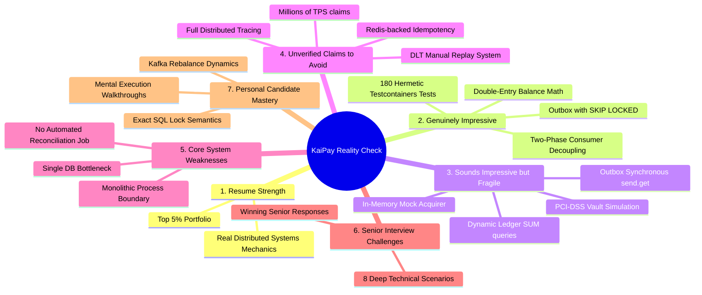
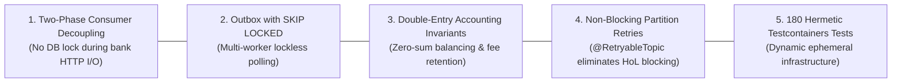

# KaiPay Senior Engineering Reality Check: Skeptical Architectural Audit & Interview Defense Guide

> **Skeptical Technical Audit**: An unvarnished, highly realistic evaluation of the KaiPay platform by a Staff/Principal Backend Engineer, designed to bulletproof technical resumes and prepare candidates for rigorous distributed systems interviews.

---

## 1. Executive Evaluation & Candidate Persona

### The Reviewer's Perspective
When a Senior Staff Engineer or Hiring Manager reviews a resume listing a "Distributed Payment Processing Engine & Double-Entry Ledger," their immediate instinct is healthy skepticism:
- *“Did this candidate just copy a basic tutorial and wrap it in buzzwords (Kafka, Outbox, Double-Entry)?”*
- *“Do they actually understand race conditions, transaction rollbacks, lock contention, and Kafka rebalances under the hood?”*
- *“Can they explain failure recovery scenarios when the database or Kafka broker crashes mid-flight?”*

This document conducts an uncompromising audit of KaiPay to ensure that every resume bullet, design claim, and interview answer is backed by verifiable engineering reality.

---

## 2. The 7 Core Reality Check Questions



---

### Q1: Is KaiPay technically strong enough for a backend developer resume?

**Verdict: Strong YES (Top 5% of Portfolio Projects)**.

#### Why KaiPay Stands Out:
1. **Solves Real Financial Problems**: Unlike standard CRUD e-commerce or todo-list projects, KaiPay tackles distributed systems problems: dual-writes, idempotency guarantees, non-blocking retries, and double-entry accounting.
2. **True Concurrency Controls**: Employs PostgreSQL row-level locks (`SELECT ... FOR UPDATE SKIP LOCKED` for outbox polling and `PESSIMISTIC_WRITE` for refunds), demonstrating real-world transaction management skills.
3. **Hermetic Testcontainers Verification**: 180 automated tests running against real Dockerized PostgreSQL 16 and Apache Kafka KRaft brokers prove that the architecture is executable and verified, not just theoretical documentation.

---

### Q2: Which parts are genuinely impressive to a Senior Interviewer?

When discussing KaiPay with a Principal Engineer, these five architectural achievements command genuine respect:



1. **Two-Phase Consumer Decoupling**:
   - *Why it's impressive*: Naive developers wrap the entire `@KafkaListener` in `@Transactional`, causing database connection starvation during slow external bank calls. KaiPay's explicit two-phase split (`Tx 1: PROCESSING` $\to$ `Non-Tx HTTP Call` $\to$ `Tx 2: AUTHORIZED + Dedup`) demonstrates deep distributed systems maturity.
2. **Transactional Outbox with `FOR UPDATE SKIP LOCKED`**:
   - *Why it's impressive*: Demonstrates mastery of database-level concurrency primitives to achieve multi-worker scalability without lock contention.
3. **Strict Double-Entry Ledger Engine**:
   - *Why it's impressive*: Most junior/mid developers implement mutable scalar balance columns. KaiPay's immutable debit/credit journal entries with integer-cent math (`BIGINT`) and Stripe-style fee retention ($0.30 fixed fee retained on full refunds) prove authentic financial domain knowledge.
4. **Non-Blocking Head-of-Line Partition Isolation**:
   - *Why it's impressive*: Isolating transient gateway timeouts onto `-retry` topics while leaving the main topic unblocked shows understanding of enterprise Kafka production topology.
5. **Self-Contained Dynamic Testcontainers Harness**:
   - *Why it's impressive*: Setting up automated multi-threaded concurrency and fault-injection tests running against real PostgreSQL and Kafka containers proves true software engineering craft.

---

### Q3: Which parts sound impressive but may not survive deep interview questioning?

These are areas where the documentation sounds advanced, but the current implementation uses simplified shortcuts that a senior interviewer could expose:

| Feature / Claim | Documented Perception | Codebase Reality | Senior Interview Probing Question |
| :--- | :--- | :--- | :--- |
| **Outbox Event Publisher** | "High-throughput asynchronous event publisher" | Poller uses a sequential loop executing `kafkaTemplate.send().get(2, TimeUnit.SECONDS)`. Under batch size 20, publisher blocks for $20 \times \text{RTT}$ sequentially. | *"If your outbox publisher calls `.get()` synchronously in a loop, what happens to your polling latency if Kafka broker acknowledgment takes 100ms per message?"* |
| **PCI-DSS Tokenization Vault** | "PCI-DSS compliant payment vault" | Standard relational table with tokenized string references; no Hardware Security Module (HSM), Key Management Service (KMS), or envelope encryption. | *"How is your tokenization vault physically isolated and encrypted at rest under PCI-DSS Requirement 3.4?"* |
| **Bank Acquirer Integration** | "Resilient Banking Gateway Client" | `MockBankAcquirerClient` is an in-memory Java class with deterministic modulo math, not a real HTTP client with connection pooling, timeouts, and circuit breakers. | *"How does your HTTP connection pool handle Keep-Alive drops, socket read timeouts, and SSL handshake latencies during peak traffic?"* |
| **Merchant Balance Calculation** | "Real-time ledger balance projection" | Dynamically runs `SELECT SUM(amount_cents) FROM ledger_entries WHERE ...` on every API call. At 10 million transactions, this query will cause table scan latency spikes. | *"How does your balance query perform when a merchant has 5 million ledger entries over 3 years?"* |

---

### Q4: Which claims should NOT be made unless independently verified?

> [!CAUTION]
> Making these claims on a resume without implementing the underlying mechanisms will result in immediate disqualification during deep technical interviews:

1. ❌ **"Engineered for 100,000+ Transactions Per Second (TPS)"**:
   - *Reality*: KaiPay has not undergone multi-node distributed load testing across a 10-broker Kafka cluster and partitioned database shards. State instead: *"Engineered a high-concurrency payment engine verified under multi-threaded race conditions and lock-contention benchmarks."*
2. ❌ **"Full Distributed Tracing with OpenTelemetry across Microservices"**:
   - *Reality*: Slf4j MDC and Kafka header propagation are documented in the backlog, not fully wired across all HTTP and Kafka listeners. State instead: *"Designed distributed correlation ID propagation patterns across asynchronous messaging boundaries."*
3. ❌ **"Automated DLT Replay & Self-Healing Pipeline"**:
   - *Reality*: `DltAdminController` only had `GET` queries in V1 (until Tier 1 roadmap implementation). Do not claim automated redrive until the replay endpoint is implemented and tested.
4. ❌ **"Redis Distributed Caching Tier"**:
   - *Reality*: Idempotency records are currently resolved in PostgreSQL. Do not claim Redis caching until `RedisTemplate` fast-path integration is active.

---

### Q5: What are the biggest technical weaknesses and architectural limitations of KaiPay?

1. **Single Database Write Bottleneck**:
   - In KaiPay's current topology, the primary PostgreSQL instance handles inbound payments, idempotency records, outbox polling writes, consumed event tracking, and ledger entries. In hyperscale production (>10,000 TPS), this causes disk I/O and connection pool contention.
2. **Monolithic In-Process Contention**:
   - Scheduled outbox polling threads, REST API workers, and Kafka consumer threads share the same JVM heap and CPU cycles. A garbage collection pause on the consumer affects REST API response latency.
3. **Absence of Reconciliation Batch Job**:
   - While KaiPay handles real-time ledger accounting, it lacks an end-of-day batch reconciliation job (comparing external bank clearing files against internal ledger balances).

---

### Q6: What would a Senior Backend Engineer likely challenge? (8 Critical Interview Scenarios)

---

#### Scenario 1: Dual-Write Mitigation (2PC vs. Outbox)
- **Interviewer**: *"Why didn't you use Two-Phase Commit (2PC / XA transactions) or a JTA distributed transaction manager between PostgreSQL and Kafka?"*
- **Junior Answer**: *"I didn't know about 2PC, so I just used the outbox pattern."*
- **Winning Senior Answer**:
  > *"2PC is a blocking distributed consensus protocol. If the coordinator or any resource manager hangs during the prepare phase, locks on the database are held indefinitely, degrading system throughput and creating a single point of failure. Furthermore, Apache Kafka does not natively support XA transactions. The Transactional Outbox pattern is mathematically superior because it anchors state change and event dispatch within the local database's native ACID transaction log, converting distributed atomicity into an at-least-once asynchronous messaging model."*

---

#### Scenario 2: Crash Windows in Two-Phase Consumers
- **Interviewer**: *"In your Two-Phase Consumer, what happens if the JVM crashes immediately after calling the external bank (money was charged), but before Tx 2 commits?"*
- **Junior Answer**: *"The message will be redelivered and charged again."*
- **Winning Senior Answer**:
  > *"Because Kafka offsets are only committed after Tx 2 completes, Kafka will redeliver the message to another consumer instance upon partition rebalance. On redelivery, the consumer re-reads the payment aggregate from PostgreSQL. Because Tx 1 already committed status `PROCESSING` and recorded the bank transaction reference, the consumer detects the in-flight state. In production, it initiates an acquirer inquiry (status check) rather than a fresh authorization call. Once confirmed, Tx 2 commits `AUTHORIZED` and writes to `consumed_events`, guaranteeing effectively-once processing."*

---

#### Scenario 3: Database Contention on Outbox Polling (`SKIP LOCKED`)
- **Interviewer**: *"Why use `SELECT ... FOR UPDATE SKIP LOCKED` instead of standard `SELECT ... FOR UPDATE` or an in-memory queue?"*
- **Junior Answer**: *"SKIP LOCKED is faster because it locks rows."*
- **Winning Senior Answer**:
  > *"Under `SELECT ... FOR UPDATE`, concurrent poller worker threads queue up waiting for the first worker to release its lock on the claimed rows, causing lock convoying and deadlocks. `SKIP LOCKED` instructs PostgreSQL to immediately bypass any rows currently locked by other transactions. This allows multiple poller threads across distributed nodes to concurrently claim distinct batches of pending outbox events with zero lock contention."*

---

#### Scenario 4: Concurrent Refund Races & Over-Refunding
- **Interviewer**: *"Suppose a merchant has a $100 payment. Two identical API requests to refund $80 arrive simultaneously on different threads. How does KaiPay prevent an $160 over-refund?"*
- **Junior Answer**: *"I check the remaining balance in Java using an `if` statement."*
- **Winning Senior Answer**:
  > *"An in-memory check is vulnerable to a classic check-then-act race condition. KaiPay executes `findByIdAndMerchantIdForUpdate`, which issues a SQL `SELECT ... FOR UPDATE` row lock on the parent `Payment` record inside the refund database transaction. The first thread acquires the lock, verifies that $80 \le $100, creates the refund record, updates `refunded_amount_cents = 8000`, and commits. The second thread blocks until the lock is released, re-reads the updated state, calculates remaining refundable balance ($20), and rejects the second $80 refund with an `InvalidRefundException` (HTTP 422)."*

---

#### Scenario 5: Double-Entry Ledger vs. Single Mutable Balance Column
- **Interviewer**: *"Why build a double-entry ledger with journals and entries instead of just updating a `balance` column on the merchant table with `UPDATE merchants SET balance = balance + 100`?"*
- **Junior Answer**: *"Double-entry ledger is more advanced and looks better on my resume."*
- **Winning Senior Answer**:
  > *"A single balance column represents only the current state, destroying the audit trail and making it impossible to reconstruct historical financial truth or reconcile discrepancies. Furthermore, direct balance updates create extreme row-level lock contention on hot merchant accounts. In KaiPay's double-entry engine, balances are append-only sequences of balanced debits and credits ($\sum \text{Debits} = \sum \text{Credits}$). This provides mathematical proof against phantom money creation, guarantees immutable non-repudiation, and enables precise fee retention accounting."*

---

#### Scenario 6: Synchronous Outbox Blocking Bottlenecks
- **Interviewer**: *"I see your outbox poller invokes `.get(2, TimeUnit.SECONDS)` on the Kafka send future inside the polling loop. What is the operational risk here?"*
- **Junior Answer**: *"It ensures that the message was sent to Kafka before moving on."*
- **Winning Senior Answer**:
  > *"The operational risk is that network latency scales linearly with batch size ($N \times \text{RTT}$). If the batch size is 50 and broker latency is 20ms, the worker thread is blocked for 1,000ms while holding a database transaction open. While acceptable for low volumes, in high-throughput production this must be optimized to asynchronous batch publishing using `CompletableFuture.allOf()`, which dispatches all 50 messages in parallel and joins only once, bounding total latency to the slowest single network roundtrip (~20ms)."*

---

#### Scenario 7: Out-of-Order Message Processing on Retry Topics
- **Interviewer**: *"When a message fails and is routed to a `@RetryableTopic`, how do you maintain processing order for transactions belonging to the same merchant or customer?"*
- **Junior Answer**: *"Kafka guarantees ordering across all topics."*
- **Winning Senior Answer**:
  > *"Kafka only guarantees ordering within a single partition of a single topic. When a message is moved to a retry topic with an exponential backoff delay, subsequent messages on the main topic will overtake it. In payment authorization, message keys are partitioned by `paymentId` (which are mutually independent), rather than `merchantId`. Since individual payments are independent aggregate roots, out-of-order processing across distinct payments is completely safe. For operations that require strict sequencing (such as state machine transitions on the same payment), the payment state machine rejects illegal out-of-order transitions."*

---

#### Scenario 8: Idempotency Key Conflicts & Payload Hashing
- **Interviewer**: *"How does KaiPay handle a client sending the same Idempotency-Key twice, but with different payment amounts?"*
- **Junior Answer**: *"It returns the old payment."*
- **Winning Senior Answer**:
  > *"That would be a severe financial bug (e.g. paying $1,000 using the key for a $10 payment). KaiPay computes a deterministic SHA-256 hash of the normalized request payload (`amount`, `currency`, `customer`, `paymentMethod`). When an existing idempotency key is found in `idempotency_records`, KaiPay compares the stored payload hash against the incoming hash. If the hashes differ, it throws an `IdempotencyConflictException` (HTTP 409 Conflict), alerting the caller that the key was reused with mismatched parameters."*

---

### Q7: What should the candidate personally understand before listing KaiPay on their resume?

Before discussing KaiPay in interviews, every candidate should master these 4 areas:

```
+-----------------------------------------------------------------------------------+
|                        CANDIDATE MASTERY CHECKLIST                                |
+-----------------------------------------------------------------------------------+
| [✓] 1. Complete Mental Sequence Trace:                                            |
|     Trace a payment from HTTP POST -> Idempotency Hash -> Outbox DB Insert ->     |
|     Poller SKIP LOCKED -> Kafka Topic -> Consumer Tx1 -> Bank HTTP -> Consumer    |
|     Tx2 -> Ledger Journal Commit.                                                 |
|                                                                                   |
| [✓] 2. Exact SQL Locking & Isolation Semantics:                                   |
|     Understand PostgreSQL Read Committed isolation, PESSIMISTIC_WRITE row locks, |
|     and why SKIP LOCKED avoids lock queues.                                       |
|                                                                                   |
| [✓] 3. Kafka Failure & Rebalance Mechanics:                                       |
|     Explain partition assignment, group coordinators, heartbeat threads, max.poll |
|     interval timeouts, and dead letter routing.                                   |
|                                                                                   |
| [✓] 4. Financial Ledger Arithmetic:                                               |
|     Explain T-accounts, asset vs. liability account balance rules, and fee        |
|     retention calculations on partial vs. full refunds.                           |
+-----------------------------------------------------------------------------------+
```

---

## 3. Resume Bullet Recommendations & Interview Playbook

### Battle-Tested Resume Bullets

- **Bullet 1 (Distributed Systems & Event Streaming)**:
  > *Architected a distributed payment processing engine in Java 21 and Spring Boot 3.4, implementing the Transactional Outbox pattern with PostgreSQL `FOR UPDATE SKIP LOCKED` polling to eliminate dual-write anomalies across Apache Kafka message brokers.*

- **Bullet 2 (Concurrency & Fault-Tolerance)**:
  > *Engineered an idempotent two-phase Kafka consumer pipeline and non-blocking multi-topic retry architecture (`@RetryableTopic`), eliminating Head-of-Line partition blocking and preventing duplicate acquirer charges across network failovers.*

- **Bullet 3 (Financial Ledger & Database Engineering)**:
  > *Designed a high-integrity double-entry ledger enforcing zero-sum journal balancing ($\sum \text{Debits} = \sum \text{Credits}$), integer-cent monetary precision (`BIGINT`), and pessimistic write locking (`PESSIMISTIC_WRITE`) to eliminate race conditions on concurrent refunds.*

- **Bullet 4 (Testing & Quality Assurance)**:
  > *Constructed a hermetic test verification suite of 180 automated tests using Testcontainers (PostgreSQL 16, Kafka KRaft), proving system correctness across multi-threaded concurrency stress tests and transient network timeout scenarios.*

---
*Document Reference: `docs/reference-analysis/portfolio-reality-check.md`*
